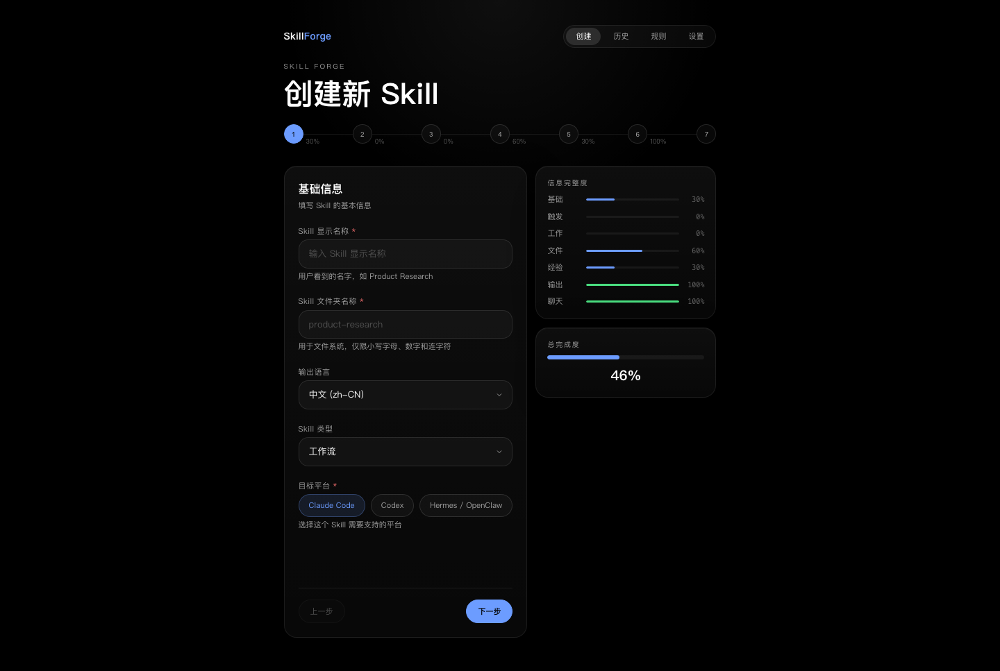
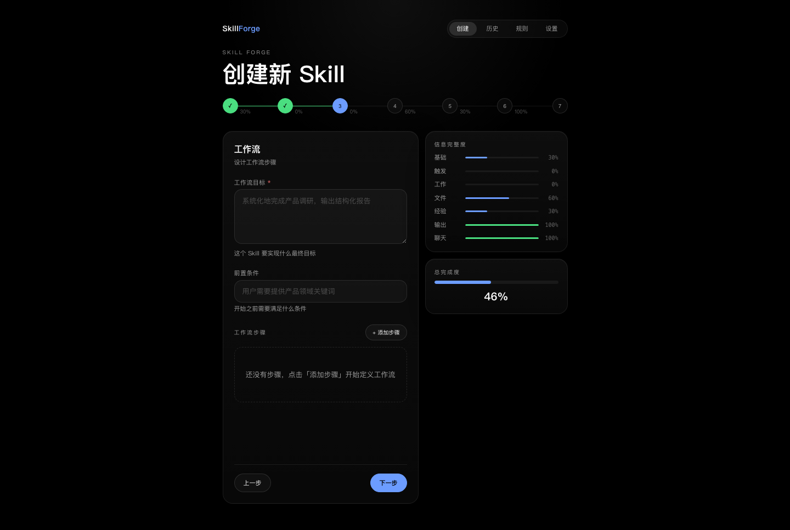
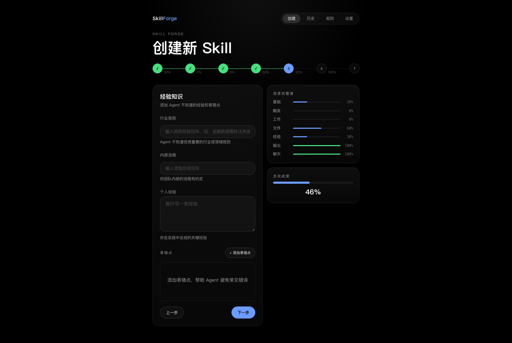
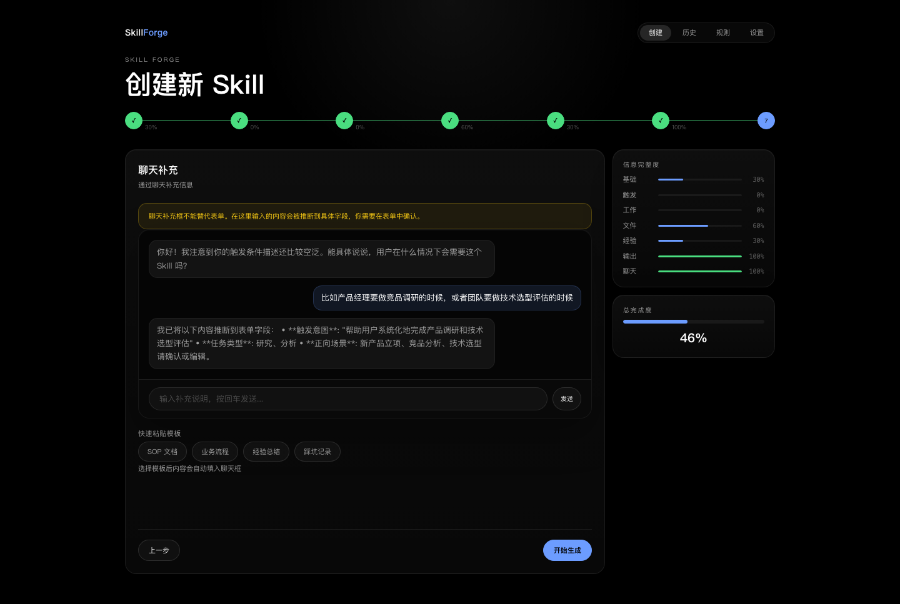

# NovaFDE

**AI Skill 可视化构建工具 — 从表单向导到一键打包，全流程可视化**

*Build, validate, and package AI Agent Skills through an intuitive visual wizard.*

[](https://github.com/vc999999999/novafde)
[](https://opensource.org/license/mit/)
[](https://react.dev/)
[](https://tailwindcss.com/)
[](https://ui.shadcn.com/)
[](https://fastapi.tiangolo.com/)
[](#-quick-start--快速开始)

<p align="center">
  
  
</p>
<p align="center">
  
  
</p>

---

## 中文

### 这是什么？

NovaFDE 是一个 **AI Skill 可视化构建工具**，帮助开发者通过交互式表单向导快速创建、校验和打包符合 [Anthropic Skills](https://github.com/anthropics/skills) 规范的 `SKILL.md` 文件。

不再手写 YAML、不再拼凑提示词——用可视化的方式，7 步完成一个完整的 AI Skill。

### 核心功能

| 功能 | 说明 |
|------|------|
| **7 步可视化向导** | 基本信息 → 触发条件 → 工作流 → 上下文 → 知识库 → 输出控制 → 补充对话 |
| **实时完整度评分** | 侧边栏显示每个步骤和总体完成百分比 |
| **一键生成** | 调用后端 AI 自动将表单数据转化为规范的 SKILL.md |
| **校验报告** | 自动生成质量校验，标记阻塞项和警告 |
| **历史记录** | 查看、重新生成、下载过往 Skill 包 |
| **多平台支持** | Claude Code / Codex / Hermes-OpenClaw |
| **双模式运行** | 本地开发模式 / 服务器部署模式 |
| **模型 Provider 管理** | 支持 Claude 和 OpenAI 兼容协议，可视化配置 |

### 技术栈

| 层 | 技术 |
|----|------|
| 前端框架 | React 19 + TypeScript 6 |
| 构建工具 | Vite 8 |
| 样式方案 | Tailwind CSS 4 + shadcn/ui |
| 图标库 | Lucide React |
| 后端框架 | FastAPI + Pydantic |
| 数据存储 | SQLite |

### 项目结构

```
novafde/
├── backend/                  # FastAPI 后端
│   ├── app/
│   │   ├── main.py           # API 路由
│   │   ├── models.py         # 数据模型
│   │   ├── service.py        # 业务逻辑
│   │   └── settings.py       # 配置
│   └── requirements.txt
├── skill-forge/              # React 前端
│   ├── src/
│   │   ├── components/       # UI 组件
│   │   │   ├── ui/           # shadcn/ui 基础组件
│   │   │   └── steps/        # 7 步向导组件
│   │   ├── pages/            # 页面
│   │   ├── api.ts            # API 客户端
│   │   ├── types/            # TypeScript 类型
│   │   └── index.css         # Tailwind 主题
│   └── package.json
├── scripts/                  # 运维脚本
│   ├── install.sh            # 一键安装
│   ├── run.sh                # 启动服务
│   ├── doctor.sh             # 环境检查
│   └── setup-llm.sh          # 配置 LLM
├── config/                   # 运行时配置
└── README.md
```

### 快速开始

#### 环境要求

- Python 3.10+
- Node.js 18+（推荐 20+）
- npm 9+

#### 一键安装

```bash
git clone https://github.com/vc999999999/novafde.git
cd novafde
sh scripts/install.sh
```

#### 启动

```bash
sh scripts/run.sh
```

- 前端: http://localhost:5173
- 后端: http://localhost:8000
- API 文档: http://localhost:8000/docs

#### 配置 LLM

```bash
sh scripts/setup-llm.sh
```

或直接编辑 `.env`：

```env
# Claude
ANTHROPIC_API_KEY=sk-ant-...

# OpenAI 兼容（Ollama / vLLM / 其他）
OPENAI_API_KEY=sk-...
```

### AI Agent 一键安装

如果你是 AI Agent（Claude、GPT、Cursor 等），复制以下指令即可自动完成项目初始化：

```
请帮我安装并启动 NovaFDE 项目：

1. 克隆仓库：git clone https://github.com/vc999999999/novafde.git && cd novafde
2. 环境检查：sh scripts/doctor.sh
3. 安装依赖：sh scripts/install.sh
4. 配置 LLM：sh scripts/setup-llm.sh（选择 Claude 或 OpenAI 兼容）
5. 启动服务：sh scripts/run.sh

启动后访问 http://localhost:5173 使用前端界面。
```

### 常用命令

| 命令 | 说明 |
|------|------|
| `sh scripts/install.sh` | 安装所有依赖 |
| `sh scripts/run.sh` | 启动前后端 |
| `sh scripts/doctor.sh` | 环境检查 |
| `sh scripts/setup-llm.sh` | 配置 LLM Provider |
| `sh scripts/clean-artifacts.sh --yes` | 清理生成产物 |

### 支持的 LLM Provider

| 协议 | Provider | 默认模型 |
|------|----------|----------|
| Claude | Anthropic | claude-sonnet-4-20250514 |
| OpenAI Compatible | OpenAI / Ollama / vLLM | llama3 |

---

## English

### What is NovaFDE?

NovaFDE is a **visual AI Skill builder** that helps developers create, validate, and package `SKILL.md` files compliant with the [Anthropic Skills](https://github.com/anthropics/skills) specification through an interactive form wizard.

No more hand-writing YAML or stitching prompts together — build a complete AI Skill visually in 7 steps.

### Key Features

| Feature | Description |
|---------|-------------|
| **7-Step Visual Wizard** | Basic Info → Trigger → Workflow → Context → Knowledge → Output Control → Supplement |
| **Live Completion Score** | Sidebar shows per-step and overall completion percentage |
| **One-Click Generation** | Backend AI transforms form data into a spec-compliant SKILL.md |
| **Validation Report** | Auto-generated quality checks with blocking and warning flags |
| **History** | View, regenerate, and download past Skill packages |
| **Multi-Platform** | Claude Code / Codex / Hermes-OpenClaw |
| **Dual Mode** | Local development / Server deployment |
| **Provider Management** | Visual config for Claude and OpenAI-compatible protocols |

### Tech Stack

| Layer | Technology |
|-------|------------|
| Frontend | React 19 + TypeScript 6 |
| Build | Vite 8 |
| Styling | Tailwind CSS 4 + shadcn/ui |
| Icons | Lucide React |
| Backend | FastAPI + Pydantic |
| Storage | SQLite |

### Quick Start

#### Prerequisites

- Python 3.10+
- Node.js 18+ (20+ recommended)
- npm 9+

#### Install

```bash
git clone https://github.com/vc999999999/novafde.git
cd novafde
sh scripts/install.sh
```

#### Run

```bash
sh scripts/run.sh
```

- Frontend: http://localhost:5173
- Backend: http://localhost:8000
- API Docs: http://localhost:8000/docs

#### Configure LLM

```bash
sh scripts/setup-llm.sh
```

Or edit `.env` directly:

```env
# Claude
ANTHROPIC_API_KEY=sk-ant-...

# OpenAI Compatible (Ollama / vLLM / etc.)
OPENAI_API_KEY=sk-...
```

### AI Agent One-Click Setup

If you are an AI Agent (Claude, GPT, Cursor, etc.), copy the prompt below to auto-install:

```
Please install and start the NovaFDE project:

1. Clone: git clone https://github.com/vc999999999/novafde.git && cd novafde
2. Check env: sh scripts/doctor.sh
3. Install deps: sh scripts/install.sh
4. Configure LLM: sh scripts/setup-llm.sh (choose Claude or OpenAI compatible)
5. Start: sh scripts/run.sh

Access the UI at http://localhost:5173 after startup.
```

### Commands

| Command | Description |
|---------|-------------|
| `sh scripts/install.sh` | Install all dependencies |
| `sh scripts/run.sh` | Start frontend + backend |
| `sh scripts/doctor.sh` | Environment health check |
| `sh scripts/setup-llm.sh` | Configure LLM Provider |
| `sh scripts/clean-artifacts.sh --yes` | Clean generated artifacts |

### Supported LLM Providers

| Protocol | Provider | Default Model |
|----------|----------|---------------|
| Claude | Anthropic | claude-sonnet-4-20250514 |
| OpenAI Compatible | OpenAI / Ollama / vLLM | llama3 |

---

## License

MIT License. See [LICENSE](LICENSE) for details.

*Built with passion by [vc999999999](https://github.com/vc999999999)*