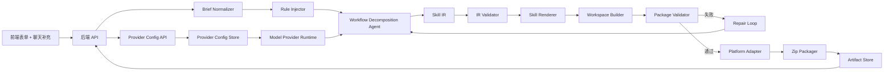

# SkillForge 后端与技术架构 PRD

## 1. 概述

**问题**：如果直接让 Agent 根据用户输入生成 Skill 文件夹，结构、触发描述、工作流拆解、上下文文件、校验和打包都会混在一个不稳定的生成步骤里，质量不可控。

**方案**：后端将用户表单和聊天补充转换成结构化 Skill Brief，再由 Agent 生成 Skill IR，中间经过规则注入、结构校验、文件渲染、质量校验、修复循环和 zip 打包，最后返回给单个用户下载。

**成功指标**：

- 生成包必须包含合法的 `SKILL.md`。
- 100% 可下载包必须通过 YAML frontmatter 和目录结构校验。
- Agent 只负责生成结构化 IR，不直接生成 zip。
- 校验失败可以进入规则化修复循环。
- 同一个 canonical Skill 可以输出 Claude Code、Codex、Hermes/OpenClaw 安装说明。
- 后端支持配置 Claude 协议和 OpenAI-compatible 协议的大模型 Provider。
- 项目支持通过 `sh` 脚本完成安装、模型配置、启动和诊断。

## 2. 技术架构



## 3. 核心原则

- **AI 负责理解，程序负责确定性产出**：Agent 负责拆解和生成 IR；后端代码负责 schema 校验、文件渲染、路径处理、zip 打包。
- **先结构化，再渲染**：不允许模型直接输出最终文件夹作为唯一产物。
- **规则数据化**：你的经验规则要沉淀成版本化 rule pack，而不是散落在 prompt 中。
- **文件系统就是上下文工程**：Skill 包通过 `SKILL.md`、`references/`、`scripts/`、`assets/` 分层承载上下文。
- **协议通过适配器隔离**：生成链路只依赖统一 Model Provider 接口，不直接绑定 Claude 或 OpenAI 请求格式。
- **脚本只做安装和运维入口**：`sh` 脚本用于安装、启动、配置、诊断，不把核心业务逻辑藏在 shell 里。
- **单人平台**：不设计多人权限、团队协作和 marketplace。

## 4. 后端范围

### 包含

- 单人 Draft API。
- Skill 生成任务。
- AI 模型供应商抽象。
- Claude 协议 Provider 配置。
- OpenAI-compatible 协议 Provider 配置。
- Provider 连接测试。
- Skill Brief 归一化。
- Skill IR 生成。
- Rule Pack 注入。
- 文件模板渲染。
- 结构校验和质量校验。
- 失败修复循环。
- zip 打包和下载。
- `sh` 安装、启动、模型配置、诊断脚本设计。
- 本地 CLI 命令契约设计。
- 单人历史记录。

### 不包含

- 多人权限。
- 团队空间。
- 协同编辑。
- 公共发布。
- marketplace。
- 计费。
- 自动安装到用户机器。
- 运行生成后的 Skill。

## 5. 推荐技术栈

### 本地优先 MVP

- **前端**：Next.js 或 React SPA。
- **后端**：FastAPI。
- **数据库**：SQLite。
- **文件存储**：本地 filesystem。
- **任务队列**：MVP 使用进程内任务；后续可换 Redis/BullMQ/Celery。
- **校验**：JSON Schema/Pydantic 校验 Skill IR；YAML parser 校验 frontmatter；自定义规则引擎校验 Skill 质量。
- **打包**：后端使用 zip 库生成压缩包。
- **模型接口**：抽象为 Model Provider，支持 Anthropic/OpenAI-compatible API。
- **CLI 包装**：MVP 可用 shell wrapper 暴露 `skillforge` 命令，后续再升级为正式 Python/Node CLI。

### 云端部署版本

- **前端**：Next.js。
- **后端**：FastAPI 或 NestJS。
- **数据库**：PostgreSQL。
- **文件存储**：S3-compatible object storage。
- **任务队列**：Redis + BullMQ 或 Celery。
- **下载链接**：短期有效签名 URL。

### 推荐选择

第一版建议使用 **Next.js + FastAPI + SQLite + 本地文件系统**。这个项目高度依赖文件生成和压缩包返回，本地优先能减少基础设施复杂度，更适合快速验证产品价值。

## 6. 核心数据模型

### SkillDraft

记录用户填写的原始需求和草稿状态。

```json
{
  "id": "draft_123",
  "status": "draft",
  "displayName": "Product Research",
  "skillName": "product-research",
  "language": "zh-CN",
  "targetPlatforms": ["claude-code", "codex", "hermes-openclaw"],
  "formInput": {},
  "chatSupplement": [],
  "createdAt": "2026-06-08T00:00:00Z",
  "updatedAt": "2026-06-08T00:00:00Z"
}
```

### SkillBrief

归一化后的用户需求，作为 Agent 输入。

```json
{
  "skillName": "product-research",
  "targetUser": "solo workflow builder",
  "triggerIntent": "",
  "antiTriggers": [],
  "workflowObjective": "",
  "workflowSteps": [],
  "contextFiles": [],
  "unknownKnowledge": [],
  "pitfalls": [],
  "targetPlatforms": ["claude-code", "codex", "hermes-openclaw"],
  "outputLanguage": "zh-CN"
}
```

### SkillIR

生成 Skill 前的标准中间表示。

```json
{
  "schemaVersion": "1.0",
  "skill": {
    "name": "product-research",
    "description": "Use when the user asks to research product opportunities, compare market signals, or turn messy product notes into a structured research workflow.",
    "language": "zh-CN"
  },
  "workflow": {
    "objective": "",
    "steps": [],
    "decisionPoints": [],
    "failureHandling": [],
    "verification": []
  },
  "contextEngineering": {
    "filesystemAssumptions": [],
    "references": [],
    "scripts": [],
    "assets": []
  },
  "agentKnowledge": {
    "unknownKnowledge": [],
    "pitfalls": [],
    "examples": [],
    "counterExamples": []
  },
  "quality": {
    "freedomLevel": "medium",
    "hardRestrictions": [],
    "softGuidance": [],
    "validationChecklist": []
  },
  "platforms": {
    "targets": ["claude-code", "codex", "hermes-openclaw"]
  }
}
```

### ModelProviderConfig

记录一个可调用的大模型 Provider。后端必须支持多个 Provider，但 MVP 可以只启用一个默认 Provider。

```json
{
  "id": "provider_123",
  "name": "claude-primary",
  "protocol": "claude",
  "baseUrl": "https://api.anthropic.com",
  "apiKeyRef": {
    "type": "env",
    "name": "ANTHROPIC_API_KEY"
  },
  "defaultModel": "claude-sonnet-4-5",
  "roles": ["generation", "repair", "validation-explanation"],
  "timeoutMs": 120000,
  "retries": 2,
  "streaming": true,
  "customHeaders": {},
  "enabled": true,
  "lastTest": {
    "status": "passed",
    "latencyMs": 820,
    "testedAt": "2026-06-08T00:00:00Z"
  }
}
```

字段要求：

- `protocol` 只能是 `claude` 或 `openai-compatible`。
- `baseUrl` 必须是合法 URL。
- `apiKeyRef` 不保存明文 key，优先引用环境变量。
- `defaultModel` 必须非空。
- `roles` 用于区分生成、修复和校验解释。
- `customHeaders` 仅用于协议需要的额外 header，不允许覆盖安全敏感 header。

### CliCommandSpec

记录项目对外提供的本地脚本和 CLI 命令契约。

```json
{
  "name": "setup-llm",
  "command": "sh scripts/setup-llm.sh",
  "purpose": "配置 Claude 协议或 OpenAI-compatible 协议的大模型 Provider。",
  "repeatable": true,
  "reads": [".env"],
  "writes": [".env", "config/providers.local.json"],
  "requiresNetwork": false,
  "dangerLevel": "low"
}
```

### GenerationJob

记录一次生成任务。

```json
{
  "id": "gen_123",
  "draftId": "draft_123",
  "status": "running",
  "stage": "rendering",
  "attempt": 1,
  "modelProviderId": "provider_123",
  "modelProtocol": "claude",
  "rulePackVersion": "2026.06.08",
  "startedAt": "2026-06-08T00:00:00Z",
  "finishedAt": null
}
```

### ValidationIssue

```json
{
  "ruleId": "trigger-description-not-summary",
  "severity": "blocking",
  "path": "SKILL.md.frontmatter.description",
  "message": "Description reads like a summary instead of a trigger condition.",
  "suggestedFix": "Rewrite the description to start with a task-trigger phrase such as 'Use when the user asks to...'."
}
```

## 7. 后端模块

### 7.1 API Layer

职责：

- 接收前端草稿。
- 创建生成任务。
- 返回生成状态。
- 返回文件预览。
- 返回校验报告。
- 返回 zip 下载链接。
- 管理单人历史记录。

建议接口：

```text
POST   /api/drafts
GET    /api/drafts
GET    /api/drafts/:id
PATCH  /api/drafts/:id
POST   /api/drafts/:id/generate
GET    /api/generations/:id
GET    /api/generations/:id/preview
GET    /api/generations/:id/validation
GET    /api/generations/:id/download
POST   /api/generations/:id/regenerate
GET    /api/rules
GET    /api/model-providers
POST   /api/model-providers
GET    /api/model-providers/:id
PATCH  /api/model-providers/:id
DELETE /api/model-providers/:id
POST   /api/model-providers/:id/test
GET    /api/cli/commands
```

### 7.2 Brief Normalizer

职责：

- 合并表单字段和聊天补充。
- 标记信息来源：form、chat、inferred、user-approved。
- 规范化 Skill 名称和文件夹名。
- 规范化平台枚举。
- 识别缺失字段。
- 输出稳定的 SkillBrief。

### 7.3 Rule Injector

将你的专业经验规则注入生成上下文。

规则类别：

- Anthropic 官方 Skill 结构。
- `description` 是触发条件而非摘要。
- Claude Code、Codex、Hermes/OpenClaw 三端路径适配。
- 文件系统上下文工程。
- 只教 Agent 未知内容。
- 提供信息，不做过度硬性限制。
- 工作流编排，而不是单兵功能。
- 易错点库。

### 7.4 Model Provider Manager

管理 Claude 协议和 OpenAI-compatible 协议的大模型配置。

职责：

- 创建、更新、删除 Provider 配置。
- 校验 Provider 字段。
- 管理默认 Provider。
- 按用途选择模型：generation、repair、validation-explanation。
- 隐藏 API Key 明文。
- 支持从 `.env` 或本地配置文件读取 key 引用。
- 提供连接测试。

协议适配：

- **Claude 协议**：使用 Claude/Anthropic 风格消息格式和鉴权 header，由适配器统一处理。
- **OpenAI-compatible 协议**：使用 OpenAI-compatible 风格消息格式，支持自定义 `baseUrl`，用于 OpenAI 官方接口或兼容服务。

连接测试要求：

- 测试必须使用最小请求，不触发完整 Skill 生成。
- 测试结果必须记录协议、模型、耗时、失败分类。
- 鉴权失败、URL 错误、模型不存在、协议不匹配必须能区分。

### 7.5 Model Provider Runtime

为 Agent 生成链路提供统一调用接口。

统一接口：

```text
generateStructuredJson(request, providerRole)
generateText(request, providerRole)
streamText(request, providerRole)
testConnection(providerId)
```

运行规则：

- 生成 SkillIR 时默认使用 `generation` 角色 Provider。
- 修复循环默认使用 `repair` 角色 Provider；未配置则回退到 `generation`。
- 校验解释默认使用 `validation-explanation` 角色 Provider；未配置则回退到 `generation`。
- 每次调用必须记录 providerId、protocol、model、latency、token usage 或可用的成本统计。
- 模型返回结构化 JSON 时必须经过 JSON schema 校验。

### 7.6 Workflow Decomposition Agent

Agent 的职责是生成 SkillIR，不直接写 zip。

职责：

- 理解用户需求。
- 把目标拆成工作流步骤。
- 识别决策分支。
- 识别验证检查点。
- 判断哪些内容放在 `SKILL.md`，哪些放到 `references/`。
- 判断是否需要 `scripts/` 或 `assets/`。
- 输出符合 schema 的 JSON。

### 7.7 IR Validator

在渲染文件前校验 SkillIR。

阻塞规则：

- 必填字段存在。
- Skill 名称文件系统安全。
- `description` 不为空。
- 工作流至少有一个具体步骤。
- references/scripts/assets 引用一致。
- target platform 枚举合法。

### 7.8 Skill Renderer

根据 SkillIR 确定性生成文件夹。

标准结构：

```text
skill-name/
  SKILL.md
  references/
  scripts/
  assets/
```

渲染规则：

- `SKILL.md` 必须包含 YAML frontmatter。
- frontmatter 至少包含 `name` 和 `description`。
- `description` 必须写成触发条件。
- `SKILL.md` 只放核心流程和导航。
- 详细领域知识进入 `references/`。
- 稳定、重复、易错的程序逻辑才进入 `scripts/`。
- 模板、图片、样例文件进入 `assets/`。

### 7.9 Package Validator

文件渲染后执行质量校验。

阻塞校验：

- 包根目录存在 `SKILL.md`。
- YAML frontmatter 能解析。
- `name` 与目录名一致。
- `description` 存在且像触发条件。
- 引用的文件真实存在。
- zip 不含路径穿越。

警告校验：

- `SKILL.md` 过长。
- 硬性限制过多。
- 泛泛而谈的 AI 常识太多。
- 缺少失败处理。
- 缺少正例或反例。
- 缺少平台安装说明。

### 7.10 Repair Loop

校验失败时，不直接丢弃结果，而是进入修复循环。

输入：

- 原始 SkillBrief。
- 当前 SkillIR。
- 失败的 ValidationIssue。
- 对应规则。
- 最大修改范围。

输出：

- 修复后的 SkillIR。
- 修改说明。

限制：

- 最多自动修复 2 次。
- 仍有阻塞失败时返回给前端。
- 修复不得擅自扩大用户需求。

### 7.11 Platform Adapter

平台适配器只生成安装说明，不复制三套 Skill。

canonical package：

```text
skill-name/
  SKILL.md
  references/
  scripts/
  assets/
```

安装说明：

```text
install/
  claude-code.md
  codex.md
  hermes-openclaw.md
```

路径建议：

- Claude Code personal skill：`~/.claude/skills/<skill-name>/`
- Claude Code project skill：`.claude/skills/<skill-name>/`
- Codex personal skill：`~/.codex/skills/<skill-name>/`
- Codex project skill：根据项目配置。
- Hermes/OpenClaw：路径保持可配置，因为不同发行或部署可能不同。

### 7.12 Zip Packager

生成最终 zip。

zip 结构：

```text
skill-name-package.zip
  skill-name/
    SKILL.md
    references/
    scripts/
    assets/
  install/
    claude-code.md
    codex.md
    hermes-openclaw.md
  validation-report.json
  package-manifest.json
```

### 7.13 Shell Script Manager

项目需要设计一组 shell 脚本，让用户可以直接安装、运行和配置 CLI。

脚本清单：

```text
scripts/install.sh
scripts/run.sh
scripts/setup-llm.sh
scripts/doctor.sh
scripts/clean-artifacts.sh
```

脚本职责：

- `install.sh`：检查 Node/Python 版本，创建虚拟环境，安装前后端依赖，初始化 SQLite，生成 `.env` 模板。
- `run.sh`：启动前端和后端，输出访问地址、日志路径和停止方式。
- `setup-llm.sh`：交互式配置 Claude 协议或 OpenAI-compatible 协议，写入 `.env` 和本地 Provider 配置。
- `doctor.sh`：检查依赖、端口、数据库、Provider 配置和可选连接测试。
- `clean-artifacts.sh`：清理生成产物，不删除用户草稿和 Provider 配置。

脚本设计约束：

- 脚本必须可重复执行。
- 脚本必须在失败时返回非零 exit code。
- 脚本必须输出清晰错误信息。
- 脚本不得打印 API Key 明文。
- 脚本不得删除用户草稿、配置和历史记录，除非命令名明确表示清理且有确认。
- 脚本必须支持从项目根目录执行。

### 7.14 CLI Command Layer

CLI 是 shell 脚本和后端能力的统一入口。MVP 可以通过 shell wrapper 实现，正式版本可迁移为 Python/Node CLI。

建议命令：

```text
skillforge install
skillforge run
skillforge doctor
skillforge config list
skillforge config set
skillforge config test
skillforge generate
skillforge validate
skillforge package
```

命令职责：

- `skillforge install`：调用安装流程。
- `skillforge run`：启动项目。
- `skillforge doctor`：执行本地环境诊断。
- `skillforge config list`：查看 Provider 配置，隐藏 key。
- `skillforge config set`：配置协议、base URL、模型、key 引用。
- `skillforge config test`：测试 Provider 连接。
- `skillforge generate`：基于本地 brief JSON 触发 Skill 生成。
- `skillforge validate`：校验一个 Skill 文件夹。
- `skillforge package`：将 Skill 文件夹打包成 zip。

CLI 约束：

- 所有写配置命令必须说明写入路径。
- 所有 Provider 输出必须隐藏 API Key。
- 所有命令必须有 `--help`。
- 需要网络的命令必须明确提示。
- 失败时必须输出可复制给 Agent 的错误摘要。

## 8. Rule Pack 设计

Rule Pack 是平台质量稳定性的核心。

```json
{
  "id": "trigger-description-not-summary",
  "category": "description",
  "severity": "blocking",
  "detector": "description lacks trigger language or concrete task conditions",
  "message": "Description must act as a trigger condition, not a summary.",
  "fixGuidance": "Use 'Use when...' phrasing and include user intent, task object, and common user phrases.",
  "positiveExample": "Use when the user asks to turn a messy SOP into a repeatable agent workflow with validation checkpoints.",
  "negativeExample": "A skill for SOPs."
}
```

初始规则类别：

- `skill-structure`
- `description-triggering`
- `platform-compatibility`
- `workflow-orchestration`
- `filesystem-context`
- `unknown-knowledge`
- `soft-guidance`
- `pitfalls`
- `package-validation`
- `model-provider-configuration`
- `protocol-compatibility`
- `cli-script-safety`
- `local-installation`

## 9. AI 生成契约

模型必须输出结构化内容，不能直接承担最终交付。

模型调用前置条件：

- 至少存在一个启用的 Model Provider。
- 默认 Provider 必须通过字段校验。
- 如果 Provider 未通过连接测试，后端可以允许生成，但必须在 GenerationJob 中标记风险。
- 如果没有任何可用 Provider，生成请求必须被阻止并返回配置错误。

模型允许输出：

- `skill_ir.json`
- 对上一版 `skill_ir.json` 的 patch。
- 校验失败后的修复说明。

模型禁止输出：

- zip 二进制。
- 无结构的最终文件树作为唯一结果。
- 未标记的隐藏假设。
- 未验证的平台路径。
- 未经过校验却宣称 production-ready 的 `SKILL.md`。

## 10. 安全和隐私

- 用户输入可能包含私有流程和业务经验，后端只存必要信息。
- 每次生成任务必须有独立工作目录。
- 文件名必须 sanitize。
- zip 打包必须防止 path traversal。
- 生成的 scripts 必须明确标记为需要用户审查。
- API Key 不得明文写入数据库。
- API Key 优先通过 `.env` 环境变量引用。
- API Key 不得出现在日志、校验报告、前端响应、CLI 输出或 zip 包中。
- Provider 配置导出时必须脱敏。
- `setup-llm.sh` 写入 `.env` 时必须避免覆盖已有 key，除非用户确认。
- 云端部署时草稿和 artifact 应加密存储。
- 下载链接应有过期时间。

## 11. 错误处理

### 可恢复错误

- 缺少必填字段。
- Skill 名称非法。
- 模型返回 JSON 不合法。
- 校验失败。
- zip 打包失败。
- Provider 未配置。
- Provider 协议不支持。
- Provider 鉴权失败。
- Provider 模型不存在。
- Provider 请求超时。
- shell 脚本缺少执行环境。

### 用户可见行为

- 显示失败阶段。
- 区分输入问题、模型问题、校验问题、打包问题。
- 区分 Provider 配置问题、协议问题、鉴权问题和网络问题。
- 保留草稿。
- 提供重试或回到表单修改。

### 后端重试策略

- 模型/API 临时失败最多重试 2 次。
- 自动修复最多 2 次。
- Provider 连接测试失败不自动重试超过 1 次，避免消耗用户额度。
- 协议不匹配、鉴权失败、模型不存在不应自动重试。
- 仍有阻塞问题则停止并返回校验报告。

## 12. 验证策略

### 结构验证

- 使用 20 个代表性 brief 生成测试包。
- 检查所有包都有合法目录。
- 检查 frontmatter 可解析。
- 解压 zip 后文件完整。
- 检查 Provider 配置 schema 合法。
- 检查 CLI 命令契约包含用途、读写路径和失败说明。

### Skill 质量验证

- 检查 `description` 是否能触发目标任务。
- 检查工作流是否包含步骤、分支、验证和失败处理。
- 检查是否减少通用 AI 常识。
- 检查是否沉淀 Agent 未知的领域知识。
- 检查是否把详细上下文放进 `references/`。

### Provider 协议验证

- 使用 mock Claude 协议服务验证请求格式转换。
- 使用 mock OpenAI-compatible 协议服务验证请求格式转换。
- 校验 Provider 连接测试能区分鉴权失败、模型不存在、URL 错误和超时。
- 校验 API Key 不会进入日志、前端响应或 zip 包。

### shell/CLI 验证

- `install.sh` 可以在干净环境中重复执行。
- `run.sh` 能输出前端和后端访问地址。
- `setup-llm.sh` 能写入 Provider 配置且不泄露 key。
- `doctor.sh` 能检查依赖、端口、数据库和 Provider 配置。
- `skillforge --help` 能列出所有命令。
- 写配置类命令必须说明写入路径。

### 回归用例

- 简单工作流 Skill。
- 复杂多步骤 Skill。
- 带 references 的 Skill。
- 带 scripts 的 Skill。
- 带 assets 的 Skill。
- 三端适配 Skill。
- 用户输入很模糊的 Skill。
- 用户输入过度强限制的 Skill。
- Claude 协议 Provider 配置。
- OpenAI-compatible 协议 Provider 配置。
- Provider 连接测试失败。
- 本地安装脚本重复执行。
- CLI 命令帮助输出。

## 13. 路线图

### MVP

- Draft API。
- Generate API。
- Skill IR schema。
- Rule Pack v1。
- ModelProviderConfig schema。
- Claude 协议 Provider adapter。
- OpenAI-compatible 协议 Provider adapter。
- Provider 配置 API 和连接测试 API。
- `SKILL.md` renderer。
- Package validator。
- zip output。
- `scripts/install.sh`、`scripts/run.sh`、`scripts/setup-llm.sh`、`scripts/doctor.sh` 的设计和实现。
- `skillforge` CLI wrapper 的设计和实现。
- 本地 artifact history。

### v1.1

- 生成进度流式返回。
- 可编辑 Skill 预览。
- 分段重新生成。
- 更细的规则解释。
- 更完整的三端安装说明。
- Provider 用量统计。
- Provider 按任务阶段选择模型。
- CLI 支持从 brief JSON 生成 zip。

### v2.0

- 可切换模型供应商。
- Rule Pack 编辑器。
- Skill 质量评分趋势。
- 本地安装助手。
- 自动评测 benchmark。
- 正式跨平台 CLI 包。
- Provider 配置导入导出。

## 14. 待确认问题

- 生成 scripts 是否默认关闭，只有用户明确打开才生成？
- warning 是否允许下载，还是必须全部确认？
- MVP 是否只做本地文件存储？
- Codex、Hermes/OpenClaw 的默认路径是否允许用户在设置里修改？
- Provider 配置是否允许保存到数据库，还是只允许保存到本地配置文件？
- CLI 命令名称使用 `skillforge` 还是 `sf`？
- `setup-llm.sh` 是否允许写入 API Key 明文到 `.env`，还是只写入环境变量名称并要求用户手动设置？

## 15. 外部兼容说明

Anthropic 的 Skill 文档说明，Skill 是一个包含必需 `SKILL.md` 和可选支持文件的文件夹；`description` 对 Agent 判断何时启用 Skill 很关键。本架构先生成 canonical Skill 文件夹，再通过 Platform Adapter 添加不同平台安装说明，避免为了三端适配复制三套内容。
