# SkillForge 后端与技术架构 PRD

## 1. 架构目标

后端把用户明确提供的业务事实保存为 `SkillDraft`，归一化为 `SkillBrief`，再确定性构建不可变 `SkillSpec`。项目封装的版本化 Skill Creator 只能依据只读 Spec 设计 `SkillIR 1.1`；程序负责规格追踪、官方校验、渲染、路径安全、平台说明和 zip 打包。

核心原则：

- 用户决定业务事实，Agent 决定 Skill 标准。
- 权威硬限制固定为用户 `mandatoryRules` 加系统最小执行基线。
- 补充说明只作为低优先级上下文。
- Agent 输出结构化 IR，不直接写 zip。
- Agent 不得修改 SkillSpec、增加硬限制或决定安全边界。
- 文件渲染、校验和打包必须确定性执行。
- 每个必需 Spec 条目必须追踪到 IR 与最终文件。
- 旧 SQLite 草稿必须兼容迁移。

```mermaid
flowchart LR
  UI["四步用户输入"] --> API["Draft API"]
  API --> DB["SQLite JSON Payload"]
  DB --> Normalizer["Brief Normalizer"]
  Normalizer --> Brief["SkillBrief"]
  Brief --> Spec["Deterministic SkillSpec"]
  Spec --> Creator["Versioned Skill Creator"]
  Creator --> IR["SkillIR 1.1 + Spec Trace"]
  IR --> Validator["Spec + IR Validator"]
  Validator --> Repair["Repair Loop"]
  Repair --> IR
  Validator --> Renderer["Deterministic Renderer"]
  Renderer --> PackageValidator["skills-ref 0.1.1"]
  PackageValidator --> Adapter["Platform Adapter"]
  Adapter --> Zip["Zip Packager"]
```



## 2. SkillDraft

`SkillDraft` 只保存用户输入，不保存 Agent 派生结果。

```json
{
  "id": "draft_123",
  "status": "draft",
  "name": "product-research",
  "displayName": "Product Research",
  "targetPlatforms": ["claude-code", "codex", "hermes-openclaw"],
  "purpose": {
    "usage": "当产品团队需要系统化完成竞品调研时使用",
    "desiredOutcome": "形成可验证的产品研究结论",
    "process": [
      "明确研究范围",
      "整理证据",
      "形成结论"
    ],
    "completionCriteria": "每个结论都有来源",
    "specialCases": "来源不足时输出缺口清单"
  },
  "knowledge": {
    "professionalInformation": ["区分事实、推断和假设"],
    "mandatoryRules": ["不得把供应商自述直接当作第三方事实"],
    "pitfalls": [
      {
        "id": "pit_1",
        "description": "把营销话术当成事实",
        "goodExample": "明确标记信息来源",
        "badExample": "直接写成市场结论"
      }
    ],
    "relatedSkills": ["web-research"]
  },
  "supplement": {
    "content": "报告表达尽量简洁。"
  },
  "createdAt": 1780915200000,
  "updatedAt": 1780915200000
}
```

必填字段：

- `displayName`
- `targetPlatforms`
- `purpose.usage`
- `purpose.desiredOutcome`
- `purpose.process`
- `purpose.completionCriteria`
- `knowledge.professionalInformation`
- `knowledge.mandatoryRules`
- `knowledge.pitfalls`

可选字段：

- `purpose.specialCases`
- `knowledge.relatedSkills`
- `supplement.content`

## 3. SkillBrief

`Brief Normalizer` 清理空白、推断语言和文件需求，并保持来源优先级。

```json
{
  "skillName": "product-research",
  "displayName": "Product Research",
  "usage": "当产品团队需要系统化完成竞品调研时使用",
  "desiredOutcome": "形成可验证的产品研究结论",
  "roughProcess": ["明确研究范围", "整理证据", "形成结论"],
  "completionCriteria": "每个结论都有来源",
  "specialCases": "来源不足时输出缺口清单",
  "professionalInformation": ["区分事实、推断和假设"],
  "mandatoryRules": ["不得把供应商自述直接当作第三方事实"],
  "pitfalls": [],
  "relatedSkills": ["web-research"],
  "supplementalContext": "报告表达尽量简洁。",
  "targetPlatforms": ["claude-code", "codex"],
  "outputLanguage": "zh-CN",
  "workflowSteps": [],
  "needsReferences": true,
  "needsScripts": false,
  "needsAssets": false
}
```

派生规则：

- `skillName` 由显示名称或用户提交名称生成安全 slug。
- `outputLanguage` 根据主要内容语言推断。
- `workflowSteps` 由 Skill Creator Agent 从 `roughProcess` 扩展。
- 存在专业信息、强制规则、常见错误、协同 Skill 或补充说明时生成 `references/`。
- 只有稳定、重复的自动化需求才生成 `scripts/`。
- 只有明确需要模板、样例文件或素材时才生成 `assets/`。

## 4. 输入优先级

固定优先级：

1. 用户 `mandatoryRules`
2. 系统最小执行基线
3. 用途、结果、流程、完成标准、专业信息、常见错误和协同 Skill
4. `supplementalContext`
5. Agent 的结构和表达决策

约束：

- `SkillIR.hardRestrictions` 必须逐字逐序等于当前 `SkillSpec.hardRestrictions`。
- 模型自行增加的硬限制必须移除并降级到 `softGuidance`。
- 补充说明可以丰富普通信息，但不能覆盖、弱化或删除强制规则。
- 常见错误必须来自用户输入，不允许用模型猜测的内容替代。
- 补充说明为空时不得产生 warning 或 blocking。

## 5. SkillSpec

`SkillSpec` 由程序确定性构建，包含身份、目标平台、触发契约、工作流阶段、完成标准、增量知识、反例、硬限制、文件策略、相关 Skill、用户补充（`userSupplements`）和稳定验收 ID。

- 初始生成创建 revision 1。
- 用户补充创建 revision 2、3；全部跳过的补充不创建新修订。
- 每条补充答案作为 `supplement.{issueId}` 进入 `userSupplements`，并成为必需 Spec Trace 条目；跨修订累积。
- 每个修订保存 SHA256，历史修订不可修改。
- `GenerationAttempt` 记录 `skillSpecRevision` 和 `skillSpecSha256`。
- 最终打包按交付候选所属的修订校验并写入 Manifest，后续修订不会追溯否决旧候选。
- 评测前由 `enforce_spec_contract` 确定性恢复：规范化 `renderedPaths` 的 Skill 目录前缀，并保证补充原文与其 trace 存在。
- Spec 可预览但不需要用户确认。

## 6. Skill Creator Agent

Skill Creator 负责：

- 把使用时机转换为触发条件式 `description`。
- 把每个大致流程阶段扩展为包含 purpose、action、input、output、validation、failureHandling 的完整步骤。
- 根据完成标准生成验证检查点。
- 根据特殊情况生成恢复策略和分支。
- 判断信息放入 `SKILL.md`、`references/`、`scripts/` 或 `assets/`。
- 保留专业信息、强制规则、常见错误和协同 Skill。
- 为相关 Skill 生成调用时机、输入、输出和失败回退的 `derived` handoff。
- 输出符合 Pydantic schema 的 `SkillIR 1.1` JSON 和完整 `specTrace`。

仓库内保存审计快照（当前 1.1.0，吸收官方 description 写法、三级渐进加载原则、发现输入、资源选择、自由度分级与反模式检查；官方交互式 eval/benchmark 工作流被排除，因为 NovaFDE 有自己的确定性校验和评测闭环）：

```text
backend/app/resources/skill_creator/1.1.0/
  SKILL.md
  provenance.json
```

description 是触发契约而非介绍词：先用一个短句说明 Skill 做什么，再以
`Use when users ask to <动作>… or mention <关键词枚举>` 列出具体用户意图和
用户实际会输入的词（含中文品牌词、领域名词、动作动词及别名），并刻意覆盖
邻近意图以对抗 under-trigger。Activation Judge 对仅有能力概述、缺少枚举触发
词的 description 在 trigger-term-quality 和 specificity 上判低分。

模型失败时不得生成静态替代作品。已有安全候选时选择历史最佳候选；没有可评估候选时返回结构化技术失败。

## 7. SkillIR

```json
{
  "schemaVersion": "1.1",
  "skill": {
    "name": "product-research",
    "description": "Use when the user needs this workflow: ...",
    "language": "zh-CN"
  },
  "workflow": {
    "objective": "形成可验证的产品研究结论",
    "steps": [],
    "decisionPoints": [],
    "failureHandling": [],
    "verification": [],
    "skillHandoffs": []
  },
  "contextEngineering": {
    "filesystemAssumptions": [],
    "references": ["references/domain-knowledge.md"],
    "scripts": [],
    "assets": []
  },
  "agentKnowledge": {
    "unknownKnowledge": [],
    "pitfalls": [],
    "examples": [],
    "counterExamples": [],
    "relatedSkills": [],
    "supplementalContext": ""
  },
  "quality": {
    "freedomLevel": "medium",
    "hardRestrictions": [],
    "softGuidance": [],
    "validationChecklist": []
  },
  "platforms": {
    "targets": ["claude-code", "codex"]
  },
  "specTrace": [
    {
      "specItemId": "workflow.stage.01",
      "irPaths": ["workflow.steps[0]"],
      "renderedPaths": ["product-research/SKILL.md"]
    }
  ]
}
```

`quality.hardRestrictions` 必须与当前 SkillSpec 完全一致。

## 8. 校验规则

Brief 阻塞规则：

- `NAME-001`：缺少 Skill 名称。
- `PURPOSE-001`：缺少使用时机。
- `PURPOSE-002`：缺少目标结果。
- `PROCESS-001`：缺少大致执行流程。
- `PROCESS-002`：缺少完成标准。
- `KNOW-001`：缺少专业信息。
- `RULE-001`：缺少强制规则。
- `KNOW-002`：缺少用户提供的常见错误或反例。

IR 阻塞规则：

- `IR-001`：核心结构缺失。
- `TRIG-001`：description 不是触发条件。
- `WF-001`：工作流为空或步骤字段不完整。
- `RULE-001`：强制规则在生成过程中丢失。

包阻塞规则：

- 缺少合法 `SKILL.md`。
- frontmatter 无法解析或名称不一致。
- 引用文件不存在。
- 文件路径不安全或 zip 存在路径穿越。
- 缺少 Spec Trace、IR 路径无效、最终文件不存在或规格内容未实现。
- `skills-ref==0.1.1` 拒绝目录、名称、description 或 frontmatter。

## 9. SQLite 与兼容迁移

SQLite 表：

- `drafts`
- `generations`
- `model_providers`
- `app_settings`

Draft 和 Generation 使用 JSON payload 保存。

SkillSpec 修订继续保存在 Generation JSON payload 中，不新增关系表。旧 Generation 缺少 Spec 时仍可读取，并由前端显示历史兼容提示。

读取旧 Draft 时执行一次确定性迁移：

- `trigger.intent` -> `purpose.usage`
- `workflow.objective` -> `purpose.desiredOutcome`
- 旧工作流的 purpose/action -> `purpose.process`
- 旧 validation -> `purpose.completionCriteria`
- 旧 failureHandling -> `purpose.specialCases`
- industryRules/internalProcesses/personalExperience -> `professionalInformation`
- industryRules -> `mandatoryRules`
- relatedTools -> `relatedSkills`
- 用户 chat messages -> `supplement.content`

迁移成功后立即以新结构重新保存，后续读取不再重复迁移。

## 10. API

```text
POST   /api/drafts
GET    /api/drafts
GET    /api/drafts/:id
PATCH  /api/drafts/:id
POST   /api/drafts/:id/generate
GET    /api/generations/:id
GET    /api/generations/:id/spec
GET    /api/generations/:id/preview
GET    /api/generations/:id/validation
GET    /api/generations/:id/download
POST   /api/generations/:id/regenerate
GET    /api/history
GET    /api/rules
GET    /api/model-providers
POST   /api/model-providers
PATCH  /api/model-providers/:id
DELETE /api/model-providers/:id
POST   /api/model-providers/:id/test
GET    /api/settings
PUT    /api/settings
GET    /api/cli/commands
```

## 11. Provider 与安全

- 支持 `claude` 和 `openai-compatible` 协议。
- API Key 只写入环境变量或本地秘密配置，响应中不得返回明文。
- 自定义 header 不得覆盖鉴权 header。
- generation Provider 缺失时阻塞生成。
- 每次生成记录 provider ID、协议和连接风险状态。
- 路径必须通过安全相对路径校验。
- zip 不允许绝对路径或 `..`。

## 12. 渲染和打包

canonical package：

```text
skill-name/
  SKILL.md
  references/
  scripts/
  assets/
install/
  claude-code.md
  codex.md
  hermes-openclaw.md
validation-report.json
package-manifest.json
```

渲染要求：

- `SKILL.md` 明确展示 Mandatory Rules。
- 专业信息、强制规则、常见错误、协同 Skill 和补充说明可进入 references。
- 补充说明章节必须标注其优先级低于强制规则。
- 仅为选中的平台生成安装说明。
- Codex 使用 `~/.agents/skills/` 与项目 `.agents/skills/`。
- Hermes 使用 `~/.hermes/skills/`；OpenClaw 单独列出 workspace、`~/.agents/skills/` 和 `~/.openclaw/skills/`。
- Manifest 记录 Creator、Prompt、Spec、Validator、Renderer 和校验规则集版本。

## 13. 验收标准

- 最新 Draft API 只返回四步模型字段。
- 旧 Draft 可读取、迁移并重新保存。
- 八类业务必填输入均有字段级阻塞校验，目标平台为空时自动回退 Claude Code。
- 生成结果完整保留强制规则和用户常见错误。
- 与强制规则冲突的补充说明不能改变硬性约束。
- Skill Creator 能从大致流程生成完整步骤。
- 相同 Draft 生成相同 SkillSpec 与 SHA256，用户补充创建不可变新修订。
- 每个必需 Spec 条目存在有效 Spec Trace。
- 每个候选和最终包通过本地官方 Agent Skills 校验。
- 前后端契约一致。
- 全部 pytest、Ruff、ESLint 和生产构建通过。
