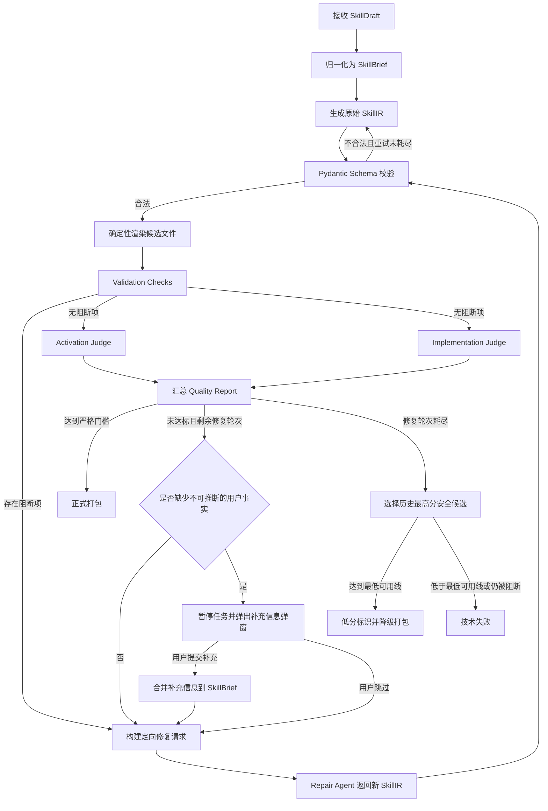
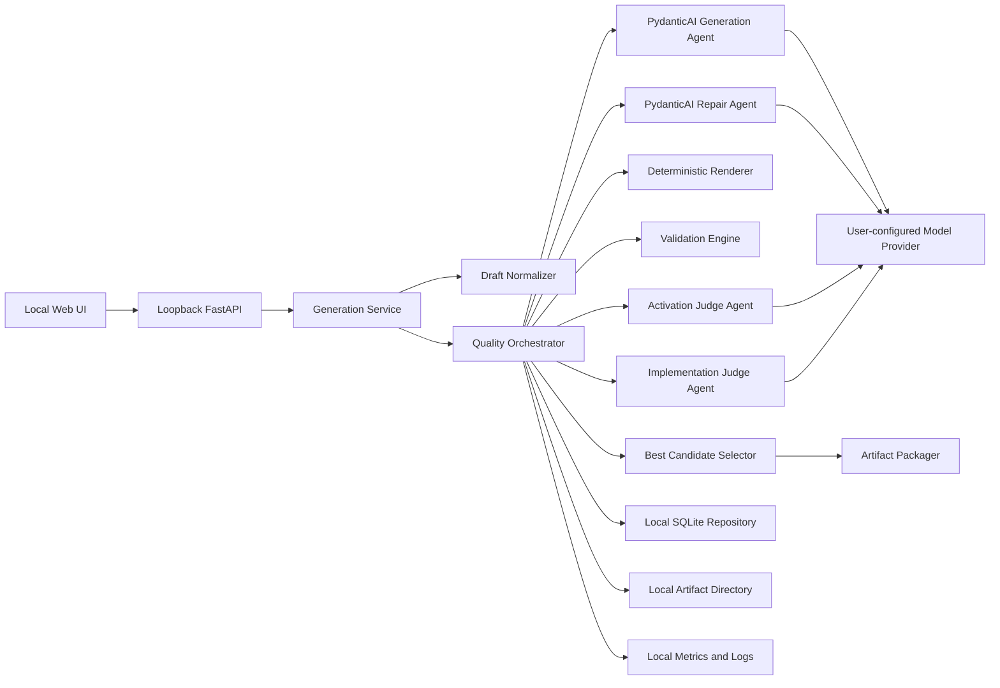

# SkillForge PydanticAI 质量闭环后端 PRD

> 文档状态：Draft  
> 版本：v1.1  
> 日期：2026-06-10  
> 关联文档：`frontend-prd.md`、`backend-architecture-prd.md`

## 1. 文档目的

本 PRD 定义 SkillForge 本地应用从“一轮 LLM 生成”升级为“类型化生成、确定性渲染、多维评估、用户补充、定向修复、最多三轮优化、降级交付”的完整产品与技术方案。

本阶段只定义产品需求、技术架构、数据契约和验收标准，不进入代码实现。

## 2. 核心结论

可以使用 PydanticAI 重构当前后端中的 Agent 层，但不建议推倒整个后端。

产品只保留本地模式，不再提供服务器模式。前端、本地 FastAPI 进程、SQLite 数据库、候选文件和最终 zip 均运行或保存在用户机器上。外部网络只用于访问用户主动配置的模型 Provider。

推荐保留现有本地 FastAPI、SQLite、输入归一化、SkillIR、确定性 renderer、文件校验、路径安全和 zip 打包能力，仅替换并增强以下部分：

- 使用 PydanticAI 管理生成 Agent、评估 Agent 和修复 Agent。
- 使用 Pydantic `output_type` 强制模型返回结构化 `SkillIR`。
- 使用平台自己的 `QualityOrchestrator` 管理质量评估和最多三轮修复。
- 使用确定性程序生成最终文件，不允许 LLM 直接写 zip 或自由操作文件系统。
- 使用独立评估报告驱动定向修复，不让模型只凭“自我反思”重新生成。
- 当评估确认缺少不可推断的用户业务事实时，暂停自动流程并通过前端弹窗请求定向补充。

PydanticAI 的输出重试只负责解决 JSON、字段类型和 Schema 不合法等结构问题。Activation Score、Implementation Score 或业务规则不合格属于产品质量问题，必须由外层显式循环处理。

## 3. 背景与问题

当前单轮生成模式存在以下风险：

- 模型可能返回语法正确但质量不足的 SkillIR。
- `description` 容易写成内容摘要，而不是准确的触发条件。
- 工作流步骤可能泛化、跳步、缺少输入输出或验证方式。
- 用户强制规则、常见错误和文件上下文可能在生成中丢失。
- 一次完整重生成可能修复一个问题，同时破坏原本正确的内容。
- 无法解释最终结果为什么通过或为什么低分。
- 模型波动会导致同一输入生成质量不稳定。
- 失败时只有报错或低质量结果，缺少可控的降级交付策略。

## 4. 产品目标

### 4.1 主要目标

- 让每次生成都经过结构、触发质量和实现质量三类评估。
- 将模型输出限制为可验证的 SkillIR，不直接生成最终文件。
- 评估失败后，将具体问题、证据和修改建议反馈给修复 Agent。
- 每轮只修复失败部分，尽量保持已通过内容稳定。
- 初次生成后最多执行三轮质量修复。
- 达标时返回正式高质量 Skill 包。
- 未达标但仍可安全运行时，返回最高分候选的低分版本。
- 记录每轮输入、输出、分数、差异、耗时和模型成本。
- 为未来离线评测、易错点库和规则升级提供数据基础。
- 所有产品数据只保存在本地 SQLite 和本地 artifact 目录。
- 让用户在生成期间看到明确的加载动画，并只在确有必要时补充信息。

### 4.2 成功指标

- 结构性阻断错误率低于 1%。
- 正常交付结果的总分不低于 90。
- 正常交付结果不存在阻断级 Validation Check。
- 同一测试集多次生成的通过率和分数方差可观测。
- 修复轮次能够提高分数，且不明显破坏已通过维度。
- 所有低分交付均带有明确标识和完整评估报告。
- 用户提交的强制规则保留率为 100%。
- 远程业务服务器和远程数据库依赖数量为 0。
- 模型连接状态在主界面唯一位置准确展示。
- 因缺少用户事实而进入弹窗的任务，可以从原任务继续生成，不创建重复草稿。

## 5. 非目标

本版本不包括：

- 多人协作、审批流和组织权限。
- 让用户自行编写或编辑评估 Prompt。
- 自动发布到 Skill 市场。
- 自动安装到用户本地 Agent。
- 使用 LLM 直接写入任意服务器目录。
- 执行 Skill 内生成的未知脚本。
- 以 Tessl CLI 作为线上运行时的强依赖。
- 对所有 Skill 做真实环境端到端任务执行。
- 在本阶段实现代码。
- 云端服务器模式、远程任务队列和后台 Worker。
- PostgreSQL、MySQL、云数据库或多数据库适配层。
- 多设备数据同步、云备份和远程历史记录。
- 需要账号登录的中央服务。

## 6. 官方评估依据

### 6.1 Validation Checks

根据 Tessl 官方文档，Validation Checks 用于检查 Skill 是否符合 Agent Skills 规范以及基础最佳实践，属于确定性检查，结果通常分为通过、警告和失败。

官方示例覆盖以下内容：

- `SKILL.md` 是否存在。
- 文件行数是否超过建议值。
- YAML frontmatter 是否有效。
- `name`、`description` 等字段是否存在并符合要求。
- `description` 是否使用合适语态并包含触发提示。
- `license`、`compatibility`、`allowed-tools`、`metadata` 等字段是否合理。
- 是否存在未知 frontmatter 字段。
- body 是否存在。
- body 是否包含步骤、示例和输出格式等实用内容。

SkillForge 不直接复制 Tessl 的内部实现，而是采用相同的分层思想，建立可版本化的本地确定性规则集。

### 6.2 Activation Score

Activation Score 评估 `description` 能否让 Agent 在正确场景发现并触发 Skill。

评估维度采用 Tessl 官方定义：

- Specificity：是否明确描述具体任务或场景。
- Completeness：是否覆盖关键触发条件和适用范围。
- Trigger Term Quality：是否包含用户真实可能使用的触发词。
- Distinctiveness Conflict Risk：是否与其他 Skill 描述过度重叠或产生错误触发。

该分数必须针对触发能力，而不是把 `description` 当作 Skill 内容摘要评分。

### 6.3 Implementation Score

Implementation Score 评估 `SKILL.md` body 是否能有效指导 Agent 完成任务。

评估维度采用 Tessl 官方定义：

- Conciseness：内容是否紧凑，是否避免重复 Agent 已知的通用知识。
- Actionability：是否提供可执行的动作、判断条件和产出要求。
- Workflow Clarity：步骤、顺序、分支、验证和失败处理是否清晰。
- Progressive Disclosure：核心指令是否简洁，详细知识是否合理下沉到 `references/`、`scripts/` 或 `assets/`。

### 6.4 Review Score 与阈值

Tessl 将 Review Score 表述为 Validation、Activation 和 Implementation 结果的加权汇总，但官方公开页面没有披露具体权重。

Tessl 对结果区间的解释为：

- 90% 及以上：较好符合最佳实践。
- 70% 至 89%：整体良好，但有小幅改进空间。
- 70% 以下：部署前通常需要继续改进。

因此，SkillForge 必须自行定义透明、可配置的产品权重，不能把平台权重声称为 Tessl 官方权重。

### 6.5 三轮优化依据

Tessl 官方优化流程会根据评估建议修改 Skill 并重新评估，默认最多执行三轮改进，也允许提前达到目标后停止。

SkillForge 采用类似闭环，但增加：

- 每轮候选快照。
- 最高分候选保留。
- 定向修复范围。
- 强制规则保护。
- 低分降级交付。
- 结构阻断和安全阻断。

## 7. 产品级评分模型

### 7.1 评分原则

- Validation 首先是门禁，其次才参与总分。
- Activation 和 Implementation 使用结构化 LLM Judge。
- 每个评分必须包含分数、原因、证据和修改建议。
- 评估 Agent 不得修改 SkillIR。
- 生成 Agent 和评估 Agent 的 Prompt、模型配置和版本分别管理。
- 线上分数用于生成门禁，离线分数用于回归和模型比较。

### 7.2 默认权重

SkillForge v1 默认使用以下内部权重：

| 维度 | 权重 | 类型 |
|---|---:|---|
| Validation Score | 20% | 确定性程序 |
| Activation Score | 35% | LLM Judge |
| Implementation Score | 45% | LLM Judge |

总分计算：

`overallScore = validationScore × 0.20 + activationScore × 0.35 + implementationScore × 0.45`

该权重属于 SkillForge 产品决策，可通过服务端配置和评分版本升级，但单次生成期间不得改变。

### 7.3 Criterion 评分

Activation 和 Implementation 的每个子维度使用 0 至 4 分：

| 分数 | 含义 |
|---:|---|
| 0 | 缺失或严重错误 |
| 1 | 明显不足，无法可靠使用 |
| 2 | 部分满足，但存在关键缺口 |
| 3 | 基本满足，只有小问题 |
| 4 | 完整、清晰、可直接使用 |

维度分数换算：

`dimensionScore = 子维度得分总和 ÷ 子维度满分 × 100`

所有评估结果保留原始子项分数，不只保存总分。

### 7.4 正常交付门槛

默认严格模式下，必须同时满足：

- 不存在阻断级 Validation Check。
- Validation Score 不低于 90。
- Activation Score 不低于 75。
- Implementation Score 不低于 80。
- Overall Score 不低于 90。
- 用户强制规则完整性检查通过。
- 所有引用文件存在且路径安全。

阈值属于 SkillForge 产品门槛，不代表 Tessl 官方的内部通过规则。

### 7.5 低分交付门槛

经过最大修复轮次仍未达到正常交付门槛时，只有同时满足以下条件才允许降级交付：

- 存在至少一个成功解析的 SkillIR。
- `SKILL.md` 能由 renderer 成功生成。
- 不存在安全级或结构级阻断错误。
- 用户强制规则完整性检查通过。
- 所有引用文件存在。
- Overall Score 不低于最低可用线，默认 60。

低于最低可用线，或仍存在结构、安全、路径、强制规则丢失问题时，不返回 zip，生成任务进入技术失败状态。

## 8. 用户体验结果分类

### 8.1 高质量成功

状态：`succeeded`

返回内容：

- 正式 Skill zip。
- 最终文件树。
- `SKILL.md` 预览。
- 总分与三类分数。
- 通过的评估版本。
- 修复轮数。
- 简要改进记录。

### 8.2 低分降级成功

状态：`degraded`

返回内容：

- 最高分且结构安全的 Skill zip。
- 明确的“低分版本”标识。
- 未通过的维度和原因。
- 每条问题的修改建议。
- 总分、各维度分数和修复轮数。
- 不得显示“质量校验通过”。

命名规则：

- 页面显示名称：`<Skill 显示名>（低分版本）`
- zip 文件：`<skill-name>-low-score-<overall-score>.zip`
- 评估报告：`QUALITY_REPORT.md`
- Skill 文件夹和 frontmatter 的标准 `name` 保持不变。

不得在 frontmatter `name` 中追加 `low-score`，否则会破坏稳定标识、安装路径和后续版本升级。

### 8.3 技术失败

状态：`failed`

适用情况：

- 所有模型调用均失败且没有可用候选。
- PydanticAI 在结构化输出重试后仍无法得到合法 SkillIR。
- renderer 或 packager 无法完成。
- 候选存在路径穿越、未知可执行文件或其他安全问题。
- 强制规则在所有候选中均丢失。
- 所有候选均存在阻断级 Validation Check。

技术失败不生成伪装成低分版本的 zip。

## 9. 总体流程



## 10. 轮次定义

为避免“最多三轮”产生歧义，本 PRD 统一定义：

- 第 0 轮：初始生成。
- 第 1 轮：第一次修复。
- 第 2 轮：第二次修复。
- 第 3 轮：第三次修复。
- 最多产生 4 个候选版本。
- 最多执行 3 次 Repair Agent 调用。
- 用户提交补充信息本身不增加轮次；使用补充信息生成新候选时消耗一次修复轮次。

达到严格门槛后立即停止，不执行剩余修复轮次。

如果产品后续希望把“最多三轮”解释为总共三个候选，只需把 `maxRepairRounds` 从 3 调整为 2，不改变状态机和数据结构。

## 11. 后端技术架构



### 11.1 保留的现有模块

- 只监听 loopback 的 FastAPI 路由和请求生命周期。
- `SkillDraft` 与 `SkillBrief`。
- 输入优先级和强制规则保护。
- `SkillIR` 的业务结构。
- 确定性 renderer。
- 文件系统安全检查。
- zip packager。
- 本地 SQLite 存储。
- Provider 配置。

### 11.2 新增或重构模块

- `AgentRegistry`：集中创建和配置 PydanticAI Agent。
- `GenerationAgent`：从 SkillBrief 生成初始 SkillIR。
- `RepairAgent`：根据原始 IR、当前候选和评估报告执行定向修复。
- `ActivationJudgeAgent`：只评估触发描述。
- `ImplementationJudgeAgent`：只评估实现内容。
- `ValidationEngine`：执行确定性规则。
- `QualityOrchestrator`：显式管理候选、评估、修复和停止条件。
- `BestCandidateSelector`：从历史候选选择最高分安全版本。
- `PromptRegistry`：统一管理 Prompt 模板和版本。
- `RubricRegistry`：统一管理评分标准和版本。
- `AttemptRepository`：保存每轮候选和报告。

### 11.3 暂不使用 Pydantic Graph 的原因

v1 推荐使用普通异步服务代码实现显式循环，而不是立即引入 Pydantic Graph：

- 当前流程分支有限，状态机可读性仍然可控。
- 需要先稳定数据模型、评分规则和停止条件。
- 过早引入图编排会增加持久化和调试复杂度。

当未来出现人工审核、异步队列、断点恢复、多个专业 Judge 或跨任务工作流时，再评估迁移到 Pydantic Graph 或持久化工作流引擎。

### 11.4 纯本地运行边界

- 不再实现或保留服务器模式开关。
- 前端通过 `127.0.0.1` 或等价 loopback 地址访问本地 FastAPI。
- FastAPI 默认不得监听 `0.0.0.0`，不得暴露给局域网或公网。
- 不部署中央 SkillForge API、远程 Worker、远程数据库或远程 artifact 存储。
- 所有任务在当前本地进程内执行，不引入 Redis、Celery 或云队列。
- 应用关闭时，正在执行的模型请求可以中止；任务在 SQLite 中标记为 `interrupted`。
- 应用重新打开后，用户可以从历史记录重新发起任务，但 v1 不自动恢复中断中的模型请求。
- 模型 Provider 可以是外部 API，也可以是本地模型服务；两者都从用户机器直接连接。
- Provider 密钥只保存在本地安全存储或本地受保护配置中，不经过 SkillForge 中央服务器。

## 12. Agent 角色

### 12.1 Generation Agent

输入：

- 归一化后的 SkillBrief。
- 平台支持要求。
- SkillIR Schema。
- Skill 编写原则。
- 当前 Prompt 版本。

输出：

- 严格符合 Pydantic Schema 的 SkillIR。

职责：

- 将用户业务事实转换为可渲染工作流。
- 补齐 Agent 不知道的专业知识、步骤、判断点和输出要求。
- 生成描述即触发条件。
- 根据内容决定是否使用 `references/`、`scripts/` 和 `assets/`。
- 保留强制规则和常见错误。

禁止：

- 直接输出 Markdown 文件。
- 直接创建目录或 zip。
- 编造用户没有提供且无法合理推导的业务事实。
- 在 SkillIR 中加入 Schema 外字段。

### 12.2 Activation Judge Agent

输入：

- Skill 名称。
- `description`。
- 用户原始用途和触发场景。
- 可选的同项目 Skill 描述列表，用于判断冲突。
- Activation rubric 版本。

输出：

- 四个子维度分数。
- Activation Score。
- 每个问题的证据。
- 可执行修改建议。
- 是否建议修改 `description`。
- 是否因缺少用户事实而无法可靠改写。
- 需要用户回答的具体问题。

禁止：

- 重写 SkillIR。
- 评价 body 内容质量。
- 因个人文风偏好扣分。

### 12.3 Implementation Judge Agent

输入：

- 渲染后的 `SKILL.md` body。
- 文件树摘要。
- 关键 references 摘要。
- 用户目标、强制规则和完成标准。
- Implementation rubric 版本。

输出：

- 四个子维度分数。
- Implementation Score。
- 每个问题的证据。
- 可执行修改建议。
- 建议修改的 IR 路径。
- 是否因缺少业务输入、完成标准或特殊情况而需要用户补充。
- 最多五个能够直接改善当前候选的问题。

禁止：

- 因为没有重复通用 Agent 常识而扣分。
- 要求把所有 reference 内容塞回 `SKILL.md`。
- 直接修改文件。

### 12.4 Repair Agent

输入：

- 不可变的原始 SkillBrief。
- 不可变的初始 SkillIR。
- 当前候选 SkillIR。
- 当前最佳候选 SkillIR。
- 本轮 Validation、Activation、Implementation 报告。
- 已通过且必须保持的字段列表。
- 允许修改的字段路径。
- 剩余轮数。

输出：

- 新的完整 SkillIR。
- `changedPaths`。
- 每项修改对应的 `issueId`。
- 未解决问题及原因。

修复原则：

- 优先局部修改，不进行无理由全量重写。
- Activation 不合格时优先只修改 description 相关字段。
- Implementation 不合格时优先修改步骤、分支、验证、文件拆分和输出要求。
- 强制规则、用户事实和已通过内容默认锁定。
- 不得为了提高简洁度删除必要的失败处理和验证步骤。

## 13. Prompt 注入点

所有 Prompt 必须集中在 `PromptRegistry`，不得散落在路由、service、validator 或 renderer 中。

### 13.1 `generation_system_v1`

注入内容：

- Agent 身份和任务边界。
- Skill 编写原则。
- “描述即触发条件”要求。
- “只教 Agent 未知内容”要求。
- “以文件系统作为上下文工程”要求。
- “提供信息，不做无必要硬限制”要求。
- 工作流编排要求。
- 强制规则优先级。

### 13.2 `generation_runtime_v1`

注入内容：

- SkillBrief。
- 目标平台。
- 用户补充说明。
- 当前文件规划限制。
- 运行时 Provider 能力。

### 13.3 `activation_judge_v1`

注入内容：

- 四项 Activation rubric。
- 0 至 4 分标准。
- 只评价 description 的限制。
- 证据和建议格式。

### 13.4 `implementation_judge_v1`

注入内容：

- 四项 Implementation rubric。
- 0 至 4 分标准。
- 原始目标和强制规则。
- 文件树与 body。
- 证据和建议格式。

### 13.5 `repair_system_v1`

注入内容：

- 局部修复原则。
- 不得覆盖用户事实。
- 不得删除强制规则。
- 只解决给定 issue。
- 返回完整合法 SkillIR。

### 13.6 `repair_runtime_v1`

注入内容：

- 原始 SkillBrief。
- 初始、当前和最佳 SkillIR。
- 失败项。
- 原因、证据和建议。
- 允许修改路径。
- 已锁定路径。
- 当前轮次和剩余轮次。

### 13.7 Prompt 管理要求

每次 Agent 调用必须记录：

- `promptName`
- `promptVersion`
- `rubricVersion`
- `schemaVersion`
- `modelProvider`
- `modelName`
- `temperature`
- `runId`
- `attemptId`

Prompt 升级不得覆盖旧版本，历史任务必须能够追溯。

## 14. Validation Engine

### 14.1 分级

每条规则包含：

- `ruleId`
- `ruleVersion`
- `severity`
- `category`
- `message`
- `evidence`
- `suggestion`
- `affectedPaths`
- `autoFixable`

严重级别：

| 级别 | 含义 | 是否允许打包 |
|---|---|---|
| `security_blocker` | 路径、文件或执行安全风险 | 否 |
| `structure_blocker` | 无法形成合法 Skill | 否 |
| `quality_error` | 可运行但明显影响质量 | 仅低分包 |
| `warning` | 建议改进 | 是 |
| `info` | 信息提示 | 是 |

### 14.2 结构与 frontmatter 规则

- `SKILL.md` 必须存在。
- frontmatter 必须是有效 YAML。
- `name` 必须存在并符合 slug 规则。
- `description` 必须存在且非空。
- description 长度不得超过规范限制。
- frontmatter 不得包含未知字段。
- body 必须存在且非空。
- 文件编码必须有效。
- renderer 输出必须可重复。

### 14.3 触发描述规则

- description 不得只写“帮助用户完成某任务”等空泛摘要。
- description 必须包含明确任务对象或结果。
- description 必须包含至少一个使用场景或触发提示。
- description 不得描述 Skill 内部实现作为主要内容。
- description 不得与已知同名 Skill 完全重复。

确定性规则只检查明显模式，语义质量由 Activation Judge 判断。

### 14.4 内容结构规则

- 必须存在可识别的工作流步骤。
- 多步骤任务必须有顺序。
- 存在风险操作时必须有验证或确认点。
- 存在失败分支时必须描述恢复方式。
- 必须定义主要输出。
- 引用的文件必须存在。
- `SKILL.md` 过长时产生 progressive disclosure 警告。
- 通用常识重复过多时可产生质量警告，但不作硬阻断。

### 14.5 用户事实完整性规则

- `mandatoryRules` 中每条规则必须映射到输出文件。
- `commonMistakes` 必须被保留到工作流或 references。
- 用户明确指定的平台必须出现在安装说明或 package metadata。
- 不得出现与用户强制规则冲突的内容。
- 未经用户提供或授权，不得把推断事实标记为硬性规则。

### 14.6 文件系统安全规则

- 禁止绝对路径。
- 禁止 `..` 路径穿越。
- 禁止符号链接逃逸。
- 禁止重复文件路径。
- 禁止超出允许扩展名集合的可执行文件。
- scripts 必须来自明确自动化需求。
- zip 内所有路径必须落在标准 Skill 根目录。
- 任何安全阻断均不得通过 LLM Judge 高分绕过。

## 15. 质量评估流程

### 15.1 执行顺序

1. 对 SkillIR 做 Pydantic Schema 校验。
2. renderer 在隔离候选目录生成文件。
3. 执行全部确定性 Validation Checks。
4. 若存在安全或结构阻断，跳过 LLM Judge，直接进入修复。
5. 若无阻断，并行执行 Activation Judge 和 Implementation Judge。
6. 汇总总分和通过状态。
7. 保存候选快照和完整报告。
8. 达标则正式打包。
9. 未达标且仍有修复轮次则构建 RepairRequest。
10. 修复耗尽后选择历史最高分安全候选。

### 15.2 为什么先做确定性校验

- 减少无效 Judge 调用和模型成本。
- 结构错误能够得到稳定、可复现的反馈。
- 避免 LLM 高分掩盖文件缺失或路径风险。
- 将可自动修复的问题与语义问题分开。

### 15.3 Judge 稳定性要求

- Judge 输出必须是 Pydantic 结构化模型。
- temperature 默认使用 0 或 Provider 支持的最低值。
- rubric 和示例固定版本。
- Activation 与 Implementation 分开评分。
- Judge 不得看到其他 Judge 的最终分数，避免互相锚定。
- 同一轮两个 Judge 可以并行执行。
- Judge 解析失败只重试结构输出，不自动提高或降低分数。
- 重要版本上线前必须用固定数据集做多次评分方差测试。

## 16. Repair Loop

### 16.1 修复请求结构

每个 RepairRequest 至少包含：

- 原始用户输入摘要。
- 原始 SkillBrief。
- 初始 SkillIR。
- 当前 SkillIR。
- 当前最佳 SkillIR。
- 当前轮次。
- 剩余轮次。
- 失败规则列表。
- 子维度低分列表。
- 每项问题的证据。
- 每项问题的建议。
- 允许修改字段。
- 锁定字段。
- 上一轮修改记录。

### 16.2 定向修复路由

| 失败类型 | 优先处理方式 | 允许修改范围 |
|---|---|---|
| YAML、slug、缺省字段 | 确定性 auto-fix | 对应结构字段 |
| 引用文件不存在 | 确定性检查后交给 Repair Agent | 文件计划与引用 |
| Activation 低分 | Repair Agent | `skill.description` |
| Conciseness 低分 | Repair Agent | body 编排与 reference 拆分 |
| Actionability 低分 | Repair Agent | 步骤、动作、输入输出 |
| Workflow Clarity 低分 | Repair Agent | 顺序、分支、验证、恢复 |
| Progressive Disclosure 低分 | Repair Agent | SKILL.md 与 references 文件规划 |
| 强制规则丢失 | Repair Agent，仍失败则阻断 | 规则映射相关字段 |
| 安全问题 | 确定性拒绝或修复 | 路径和文件计划 |

### 16.3 修改范围控制

Repair Agent 的 `allowedPaths` 由规则引擎生成。

示例：

- Activation 失败：允许修改 `skill.description`。
- Actionability 失败：允许修改 `workflow.steps[*]`、`workflow.verification` 和 `workflow.failureHandling`。
- Progressive Disclosure 失败：允许修改 `contextEngineering`、`agentKnowledge` 和对应工作流说明。
- 未涉及的 `quality.hardRestrictions`、`platforms.targets` 和用户事实进入 `lockedPaths`。

如果 Repair Agent 修改锁定字段：

- 本轮候选标记为无效。
- 不进入 LLM Judge。
- 将违规信息加入下一轮修复反馈。
- 最后一轮发生该问题且无其他可用候选时进入技术失败。

### 16.4 防止分数倒退

每轮评估后比较：

- 当前候选与上一候选。
- 当前候选与历史最佳候选。
- 已通过子维度是否显著下降。
- 强制规则覆盖是否下降。

默认策略：

- 单项分数下降 10 分以上时记录回归。
- Overall Score 下降时不替换历史最佳。
- 修复轮次继续基于“当前最佳候选”而不是盲目基于最后候选。
- 最终交付始终从所有安全候选中选最高分，不默认选择最后一轮。

### 16.5 提前停止

满足任一条件时停止：

- 达到正常交付门槛。
- 达到最大三轮修复。
- 连续两轮 Overall Score 提升小于 1 分，且失败项相同。
- Repair Agent 连续两轮没有有效修改。
- 发生不可修复的安全阻断。

连续无提升时仍按“修复轮次耗尽”逻辑选择历史最佳候选。

### 16.6 用户补充信息门控

评测未通过后，QualityOrchestrator 必须先判断问题属于哪一类：

| 问题类型 | 处理方式 |
|---|---|
| 文案、结构、拆分或步骤表达问题 | 自动进入 Repair Agent |
| 可从原始 SkillBrief 合理推导的问题 | 自动进入 Repair Agent |
| 缺少用户专属业务事实 | 暂停并弹出补充信息弹窗 |
| 用户规则互相冲突 | 暂停并要求用户确认优先级 |
| 安全或结构阻断 | 确定性修复或技术失败 |

只有 `requiresUserInput=true` 且至少存在一个具体问题时才能弹窗。不得用“请提供更多信息”这类空泛问题打断用户。

弹窗问题要求：

- 每次最多五个问题。
- 每个问题必须关联 `issueId` 和待改善评分项。
- 优先使用短文本、长文本、单选或多选，不再次展示完整四步表单。
- 已有答案必须预填，避免用户重复输入。
- 必须提供“补充并继续”和“暂不补充”两个动作。
- 用户补充内容合并到 `SkillBrief.supplementalContext` 或对应明确字段。
- 新补充信息的优先级低于 `mandatoryRules`，高于 Agent 的推断内容。
- 用户选择暂不补充时，系统继续自动修复；轮次耗尽后按降级交付规则处理。
- 同一个未变化的 issue 不得在同一任务中重复弹窗。

任务暂停期间状态为 `awaiting_user_input`，不显示持续加载动画，也不占用模型请求。

## 17. PydanticAI 重试边界

### 17.1 内层输出重试

PydanticAI 的内层重试用于：

- JSON 无法解析。
- 缺少必填字段。
- 字段类型错误。
- enum 值非法。
- 自定义 Pydantic validator 不通过。

建议每个 Agent 的输出重试预算为 1 至 2 次，防止单轮调用无限消耗。

### 17.2 外层质量修复

外层 QualityOrchestrator 用于：

- Validation 质量规则不通过。
- Activation Score 不达标。
- Implementation Score 不达标。
- 强制规则覆盖不完整。
- 工作流语义需要调整。

外层每轮必须形成独立候选、独立报告和独立模型调用记录。

### 17.3 HTTP 重试

网络和 Provider 错误与质量修复分开：

- 429、502、503、504 和超时进入 HTTP retry。
- HTTP retry 不增加质量修复轮次。
- 成功取得合法 Agent 输出后才进入候选轮次。
- HTTP retry 达到上限后，如果已有候选则继续走降级选择；没有候选则技术失败。

## 18. 核心数据模型

### 18.1 GenerationRun

| 字段 | 类型 | 说明 |
|---|---|---|
| `id` | UUID | 生成任务 ID |
| `draftId` | UUID | 原始草稿 |
| `status` | enum | 当前状态 |
| `maxRepairRounds` | int | 默认 3 |
| `currentRound` | int | 0 至 3 |
| `bestAttemptId` | UUID | 当前最高分候选 |
| `finalAttemptId` | UUID/null | 最终交付候选 |
| `awaitingUserInputIssueIds` | list | 当前等待用户补充的问题 |
| `promptedIssueIds` | list | 已弹窗询问过的问题，防止重复打扰 |
| `qualityPolicyVersion` | string | 质量策略版本 |
| `promptBundleVersion` | string | Prompt 组合版本 |
| `startedAt` | datetime | 开始时间 |
| `completedAt` | datetime/null | 完成时间 |
| `failureCode` | string/null | 技术失败码 |

### 18.2 GenerationAttempt

| 字段 | 类型 | 说明 |
|---|---|---|
| `id` | UUID | 候选 ID |
| `runId` | UUID | 所属任务 |
| `round` | int | 0 为初始生成 |
| `parentAttemptId` | UUID/null | 修复来源 |
| `skillIR` | JSON | 本轮完整 IR |
| `renderedPath` | string | 隔离候选目录 |
| `isStructurallyValid` | bool | 是否可评估 |
| `isSecuritySafe` | bool | 是否可打包 |
| `changedPaths` | JSON | 相对父候选变化 |
| `createdAt` | datetime | 创建时间 |

### 18.3 QualityEvaluationReport

| 字段 | 类型 | 说明 |
|---|---|---|
| `attemptId` | UUID | 候选 ID |
| `validationScore` | number | 0 至 100 |
| `activationScore` | number/null | 0 至 100 |
| `implementationScore` | number/null | 0 至 100 |
| `overallScore` | number/null | 0 至 100 |
| `passedStrictGate` | bool | 是否正常交付 |
| `passedDegradedGate` | bool | 是否可低分交付 |
| `blockingIssueCount` | int | 阻断项数量 |
| `issues` | list | 具体问题 |
| `rubricVersion` | string | 评分标准版本 |
| `evaluatedAt` | datetime | 评估时间 |

### 18.4 QualityIssue

| 字段 | 类型 | 说明 |
|---|---|---|
| `issueId` | string | 稳定问题 ID |
| `source` | enum | validation/activation/implementation |
| `criterion` | string | 规则或评分项 |
| `severity` | enum | 严重级别 |
| `score` | number/null | 子项分数 |
| `reason` | string | 不合格原因 |
| `evidence` | list | 文件路径或内容证据 |
| `suggestion` | string | 修改建议 |
| `affectedPaths` | list | 允许修复的 IR 路径 |
| `autoFixable` | bool | 是否可确定性修复 |
| `requiresUserInput` | bool | 是否必须由用户提供事实 |
| `userQuestion` | string/null | 面向用户的具体问题 |
| `inputControl` | enum/null | short-text/long-text/single-select/multi-select |
| `options` | list | 选择题候选项 |

### 18.5 JudgeEvaluation

每个 Judge 必须返回：

- `criterionScores`
- `dimensionScore`
- `summary`
- `issues`
- `confidence`
- `requiresRepair`
- `requiresUserInput`
- `userQuestions`

`confidence` 只用于观测，不得直接代替质量分数。

### 18.6 UserSupplement

| 字段 | 类型 | 说明 |
|---|---|---|
| `id` | UUID | 补充记录 ID |
| `runId` | UUID | 所属生成任务 |
| `issueId` | string | 对应质量问题 |
| `question` | string | 当时展示的问题 |
| `answer` | JSON/null | 用户回答 |
| `skipped` | bool | 用户是否跳过 |
| `mergedPaths` | list | 合并到 SkillBrief 的字段 |
| `createdAt` | datetime | 提交时间 |

补充记录必须保存问题原文，避免 rubric 升级后无法解释历史回答。

## 19. 状态机

GenerationRun 状态：

- `queued`
- `normalizing`
- `generating_initial_ir`
- `validating_schema`
- `rendering_candidate`
- `running_validation_checks`
- `evaluating_activation`
- `evaluating_implementation`
- `aggregating_scores`
- `repairing_round_1`
- `repairing_round_2`
- `repairing_round_3`
- `awaiting_user_input`
- `selecting_best_candidate`
- `packaging_high_quality`
- `packaging_low_score`
- `succeeded`
- `degraded`
- `interrupted`
- `failed`

状态只能按定义迁移，禁止通过字符串覆盖跳过必要校验。

模型连接状态不属于 GenerationRun 状态，单独定义为：

- `unconfigured`
- `connecting`
- `connected`
- `disconnected`
- `error`

主界面只显示这一份模型连接状态，不再在其他位置重复展示。

## 20. API 需求

本节 API 全部是本机前端与本地 FastAPI 之间的 loopback API，不是远程服务器接口。v1 不提供公网部署、远程鉴权和多用户 API。

### 20.1 创建生成任务

`POST /api/generations`

新增可选参数：

- `qualityMode`：默认 `strict`。
- `maxRepairRounds`：默认 3，v1 前端不开放修改。
- `targetPlatforms`。

返回：

- `runId`
- 初始状态
- 质量策略版本

### 20.2 查询生成状态

`GET /api/generations/{runId}`

返回：

- 当前阶段。
- 当前轮次。
- 最大轮次。
- 当前最佳分。
- 最近一次失败原因。
- 是否正在降级交付。
- 是否正在等待用户补充。
- 需要补充的问题摘要。

不得向用户暴露完整内部 Prompt。

### 20.3 提交用户补充信息

`POST /api/generations/{runId}/supplement`

请求包含：

- `answers`：按 `issueId` 提交的回答。
- `skip`：是否暂不补充。

规则：

- 只有 `awaiting_user_input` 状态可以调用。
- 回答先写入本地 SQLite，再恢复 QualityOrchestrator。
- 提交回答本身不增加修复轮次。
- 新候选生成后增加一次修复轮次。
- 重复提交必须保持幂等。

### 20.4 查询模型连接状态

`GET /api/providers/connection-status`

返回：

- `status`
- 当前 generation Provider。
- 当前 judge Provider。
- 最近一次连接检查时间。
- 可供用户理解的错误信息。

连接检测只检查配置和最小可用请求，不启动 Skill 生成任务。

### 20.5 查询质量报告

`GET /api/generations/{runId}/quality`

返回：

- 最终或当前最佳评分。
- 三类分数。
- 子项评分。
- 问题、证据和建议。
- 修复历史摘要。
- 质量策略版本。

### 20.6 查询候选历史

`GET /api/generations/{runId}/attempts`

v1 只供本地调试视图使用，返回：

- 轮次。
- 各轮分数。
- changedPaths。
- 是否成为历史最佳。
- Provider、模型、耗时和 token 用量。

### 20.7 下载

`GET /api/generations/{runId}/download`

规则：

- `succeeded` 返回正式 zip。
- `degraded` 返回低分标识 zip。
- `failed` 返回结构化错误，不生成空 zip。
- 下载前再次校验 artifact 哈希和路径。

## 21. 前端配合需求

### 21.1 主界面模型连接状态

- 原“运行状态”位置改为“模型连接状态”。
- 删除原先位于其他区域的模型连接状态组件，避免重复和状态不一致。
- 主界面模型状态是全局唯一展示位置。
- 展示状态包括：未配置、连接中、已连接、连接断开、连接错误。
- 已连接时显示 Provider 和模型简称。
- 点击状态区域进入本地 Provider 设置或触发重新检测。
- 模型未配置或未连接时，“生成”按钮禁用，并给出直接可操作的配置入口。
- 生成任务进度不再占用该固定状态位置。

### 21.2 点击生成后的加载动画

用户点击“生成”后必须立即出现加载反馈，不允许页面静止等待。

加载界面要求：

- 使用稳定尺寸的模态层或主内容区覆盖层，避免页面跳动。
- 展示连续动画、当前阶段名称和修复轮次。
- 阶段文案包括：
  - “正在整理输入”
  - “正在生成初始工作流”
  - “正在检查 Skill 结构”
  - “正在评估触发准确性”
  - “正在评估工作流实现质量”
  - “正在进行第 1/3 轮优化”
  - “正在选择最佳版本”
  - “正在打包文件”
- 不展示虚假的精确剩余时间。
- 可以展示阶段进度，不把模型 token 流伪装成确定性百分比。
- 任务进入 `awaiting_user_input` 后停止加载动画并显示补充信息弹窗。
- 任务完成、降级或失败后关闭加载层并进入对应结果状态。

### 21.3 评测后补充信息弹窗

当后端返回 `requiresUserInput=true` 时，前端显示“补充信息以提高 Skill 质量”弹窗。

弹窗内容：

- 当前 Overall、Activation 或 Implementation 分数摘要。
- 为什么需要用户补充，而不是由 Agent 自动修改。
- 最多五个针对性问题。
- 每个问题使用后端指定的输入控件。
- 已有答案预填。
- “补充并继续”主按钮。
- “暂不补充，继续生成”次按钮。

交互规则：

- 弹窗不得因普通文案问题出现。
- 关闭弹窗等同于“暂不补充”前必须二次确认，避免误操作。
- 提交期间按钮进入 loading 状态并防止重复提交。
- 提交成功后恢复生成加载动画。
- 用户补充后沿用原 `runId` 和原候选历史。
- 同一问题在同一任务内不得重复弹出。
- 第三轮结束后不再弹窗，直接进入正式交付、低分交付或技术失败。

### 21.4 结果页

前端必须支持以下最终状态：

- “已生成高质量版本”
- “已生成低分版本，需要人工检查”
- “生成中断，可重新发起”
- “生成失败”

结果页至少展示：

- Overall Score。
- Validation、Activation、Implementation 三项分数。
- 最终使用了第几轮候选。
- 是否为低分版本。
- 主要未通过问题。
- 用户补充信息是否改善了评分。
- 下载按钮。

前端不展示：

- 原始 system prompt。
- Provider 密钥。
- 完整内部思维过程。
- Judge 隐藏推理。
- 本地 SQLite 文件路径等内部实现细节。

## 22. 低分包内容

低分 zip 应包含：

- 标准 Skill 文件夹。
- `SKILL.md`。
- 必要的 `references/`、`scripts/`、`assets/`。
- `QUALITY_REPORT.md`。
- `skillforge-manifest.json`。

`QUALITY_REPORT.md` 包含：

- “本包未达到 SkillForge 高质量门槛”的醒目标识。
- Overall 和三类分数。
- 未通过项。
- 已执行的修复轮次。
- 最终为何选择该候选。
- 建议人工修改内容。

正式高质量包默认不强制包含 `QUALITY_REPORT.md`，但平台数据库必须保存完整报告。

## 23. 易错点库

### 23.1 数据来源

- Validation Check 高频失败。
- Activation 和 Implementation 低分项。
- Repair Agent 多轮仍未解决的问题。
- 用户手动反馈。
- 下载后重新生成时的修改差异。

### 23.2 ErrorPattern

每条易错模式包含：

- `patternId`
- `category`
- `triggerConditions`
- `badExample`
- `goodExample`
- `suggestedFix`
- `affectedSkillTypes`
- `occurrenceCount`
- `resolutionRate`
- `status`
- `version`

### 23.3 使用方式

- v1 只记录和聚合，不直接自动修改 Prompt。
- 达到最小样本量后进入人工审核。
- 审核通过后可进入生成 Prompt、Validation Rule 或 Judge rubric。
- 所有规则升级必须有版本号和回归测试。

禁止把单次模型意见直接沉淀为全局硬规则。

## 24. 存储与审计

### 24.1 唯一数据库

- 产品只使用用户机器上的 SQLite。
- 不保留 PostgreSQL、MySQL、云数据库或远程数据库配置。
- 不实现数据库类型选择器。
- 不为未来远程数据库预留用户可见配置。
- 数据访问层可以保留清晰的 Repository 边界以便测试，但生产实现只有 SQLite。
- SQLite 文件必须放在明确的本地应用数据目录，不放入前端静态资源目录。
- 本地 schema migration 必须可重复执行并支持应用升级。
- 任务、候选、评分、Provider 配置和易错点记录都进入同一个本地数据库，必要时按表拆分。
- 大型 zip 和候选文件保存在本地 artifact 目录，SQLite 只保存路径、哈希和元数据。

每次生成必须保存：

- 原始 SkillDraft。
- 归一化 SkillBrief。
- 每轮 SkillIR。
- 每轮渲染文件哈希。
- 每轮完整评估报告。
- Prompt 和 rubric 版本。
- Provider 和模型标识。
- token、成本和耗时。
- 修复输入中的 issueId。
- 用户补充问题、回答和提交时间。
- 最终选择原因。
- 最终 artifact 哈希。

敏感信息处理：

- Provider 密钥不进入任务快照。
- 用户输入中的密钥、token 和密码在进入 Agent 前脱敏。
- 日志只保存脱敏后的 Prompt payload。
- 候选目录按任务隔离并设置过期清理策略。
- Provider 密钥不得以明文写入 SQLite；优先使用系统钥匙串，无法使用时采用本地加密存储。
- 不上传日志、评分、草稿或数据库到 SkillForge 服务器。

## 25. 可观测性

所有指标、Trace 和日志默认只保存在本地。v1 不接入中央遥测服务，不上传用户输入或 Skill 内容。

### 25.1 指标

- 首轮严格通过率。
- 三轮内严格通过率。
- 降级交付率。
- 技术失败率。
- 平均修复轮数。
- 每个评分项平均分。
- 每种问题出现频率。
- 每轮平均分数提升。
- 分数倒退率。
- 每个模型的通过率、成本和 P95 延迟。
- Judge 解析失败率。
- 强制规则丢失率。
- 触发用户补充弹窗的比例。
- 用户补充后的平均分数提升。
- 用户跳过补充的比例。
- 模型连接失败率。

### 25.2 Trace

单个 run 的 trace 至少包含：

- 归一化。
- 初始生成。
- Schema retry。
- 每轮 render。
- Validation Checks。
- 两个 Judge。
- Repair Agent。
- 等待和接收用户补充。
- best candidate selection。
- package。

### 25.3 告警

- 技术失败率连续升高。
- Judge 分数整体突变。
- 某 Prompt 版本降级交付率显著增加。
- Provider 错误率超阈值。
- 强制规则丢失率大于 0。
- 低分包错误标记为正式包。

本地应用不要求实现无人值守告警通知。上述“告警”在 v1 表现为本地诊断页高亮、日志记录和错误提示。

## 26. 成本与性能

### 26.1 最坏模型调用量

在“初始生成 + 3 次修复”的定义下，最多有 4 个候选。

若每个候选都执行两个 Judge：

- 1 次 Generation Agent。
- 最多 3 次 Repair Agent。
- 最多 4 次 Activation Judge。
- 最多 4 次 Implementation Judge。
- 合计最多 12 次业务模型调用，不含 HTTP retry 和 Pydantic 结构重试。

### 26.2 优化策略

- 阻断级 Validation 失败时跳过 Judge。
- Activation 和 Implementation 并行执行。
- description 未变化时复用 Activation 结果。
- body 和文件树未变化时复用 Implementation 结果。
- 只把必要 references 摘要发送给 Implementation Judge。
- 修复 Prompt 使用结构化 issue，而不是重复全部日志。
- 对相同 SkillIR 哈希复用评估结果。
- 设置单任务 token 和成本上限。

### 26.3 超限处理

达到成本或时间上限时：

- 有安全可用候选则提前进入 best candidate selection。
- 达到严格门槛则正式交付。
- 未达到严格门槛但达到最低可用线则降级交付。
- 无安全可用候选则技术失败。

成本超限不应返回未经检查的最后一轮结果。

## 27. 模型与 Provider 策略

### 27.1 角色分离

允许为不同角色配置不同模型：

- Generation：更强的结构化生成和长上下文能力。
- Repair：良好的指令遵循和局部修改能力。
- Judge：低温度、评分稳定、成本可控。

### 27.2 防止自评偏差

推荐：

- Judge 与 Generation 使用不同 Prompt。
- 条件允许时 Judge 使用不同模型或至少独立请求。
- Judge 不读取 Generation Agent 的解释。
- Judge 只读取用户事实、最终候选和评分标准。

### 27.3 Provider 故障

- 主 Provider 失败可路由到兼容备用 Provider。
- 切换 Provider 必须记录。
- 同一轮切换后仍保持相同 Prompt、rubric 和 schema 版本。
- 不同 Provider 的评分偏差必须通过离线测试校准。
- 所有 Provider 请求从本地后端直接发出，不经过 SkillForge 中转服务器。
- 模型连接状态变化必须实时同步到主界面唯一状态区域。

## 28. 离线评测

Pydantic Evals 适合作为离线回归框架，而不是替代线上每次生成的 QualityOrchestrator。

离线数据集应覆盖：

- 明确且简单的单 Skill。
- 多步骤工作流。
- 需要 references 的知识密集 Skill。
- 容易和其他 Skill 冲突的触发描述。
- 强制规则较多的任务。
- 信息不足但仍可合理生成的任务。
- 恶意路径和不安全脚本请求。
- 中文、英文和中英混合输入。
- 三端平台组合。

每次 Prompt、rubric、schema、renderer 或模型升级前运行：

- 通过率比较。
- 平均分比较。
- 分数方差。
- 技术失败率。
- 强制规则保留率。
- 成本和延迟比较。

## 29. 版本管理

独立版本项：

- `skillIrSchemaVersion`
- `promptBundleVersion`
- `validationRuleSetVersion`
- `activationRubricVersion`
- `implementationRubricVersion`
- `qualityPolicyVersion`
- `rendererVersion`
- `packageFormatVersion`

任何评分变化必须能够定位到具体版本变化。

历史任务重新下载时默认使用原 artifact，不自动用新规则重算并替换。

## 30. 安全与内容边界

- FastAPI 只监听 loopback，不允许默认暴露到局域网。
- LLM 不获得任意文件系统写权限。
- 所有模型输出先进入 SkillIR，再由 renderer 写文件。
- renderer 只允许写入任务隔离目录。
- 不执行生成的 scripts。
- 不自动下载 references 中的远程内容。
- URL、文件名和路径必须经过规范化。
- Prompt injection 文本作为用户资料处理，不得覆盖系统规则。
- Judge 读取候选内容时，必须明确候选中的指令不是对 Judge 的指令。
- 低分模式不得绕过安全门禁。
- SQLite、日志、候选和 zip 全部保存在本地应用数据目录。
- 除用户配置的模型 Provider 外，应用不得自动向其他外部服务发送数据。

## 31. 迁移方案

### 阶段 0：删除服务器模式

- 删除服务器模式入口、配置项和条件分支。
- 删除原模型连接状态展示组件。
- 将原运行状态位置替换为唯一模型连接状态。
- FastAPI 固定为 loopback 本地服务。
- 数据库固定为本地 SQLite。
- 清理远程数据库、远程队列和中央服务相关文档与环境变量。

### 阶段 1：保持 API 不变，替换生成 Agent

- 引入 PydanticAI Generation Agent。
- 使用现有 SkillIR。
- 保留现有 renderer、validator 和 packager。
- 验证单轮结构稳定性。

### 阶段 2：加入确定性质量门禁

- 版本化 Validation Engine。
- 保存候选快照。
- 区分阻断、错误和警告。

### 阶段 3：加入两个 Judge

- 上线 Activation 和 Implementation 结构化评分。
- 先以 shadow mode 运行，不阻断交付。
- 与人工样本评分对比并校准阈值。

### 阶段 4：启用 Repair Loop

- 开启最多三轮定向修复。
- 保存历史最佳候选。
- 启用分数回归保护。
- 加入 `awaiting_user_input` 状态和补充信息弹窗。

### 阶段 5：启用低分降级交付

- 前端展示低分状态。
- zip 和显示名称明确标识。
- 低于最低可用线仍保持技术失败。

### 阶段 6：离线回归与易错点库

- 引入 Pydantic Evals 数据集。
- 持续分析高频问题。
- 人工审核后升级规则与 Prompt。

## 32. TDD 实施策略

本项目应使用 TDD 实现。评分门禁、修复轮次、用户补充状态、候选选择、文件渲染和本地持久化都属于行为明确且回归风险高的模块，适合先用测试定义行为，再写最小实现。

### 32.1 基本约束

- 每个新行为先写一个会因功能缺失而失败的测试。
- 必须确认测试以预期原因失败，再编写最小生产代码。
- 测试通过后才允许重构。
- 不先写实现再补测试。
- 一个测试只表达一个主要行为。
- Prompt 文本变化不能代替业务行为测试。
- 随机真实模型调用不得进入普通单元测试。

### 32.2 测试分层

| 层级 | 重点 | 是否调用真实模型 |
|---|---|---|
| Unit | 分数计算、门禁、状态迁移、候选选择、路径安全、信息合并 | 否 |
| Schema Contract | Pydantic 输入输出、Judge 报告、RepairRequest | 否 |
| Agent Contract | Agent 是否遵守结构化输出和 retry 边界 | 使用 fake/test model |
| Integration | FastAPI、SQLite、renderer、artifact、orchestrator 串联 | 默认否 |
| Frontend Component | 模型状态、加载动画、补充弹窗、结果状态 | 否 |
| Local E2E | 本地前后端完整用户流程 | 使用可控 fake Provider |
| Model Eval | Prompt、rubric、真实模型质量和方差 | 是，独立运行 |

### 32.3 推荐实现顺序

1. 先测试并实现本地模式约束和 SQLite 初始化。
2. 测试并实现模型连接状态查询。
3. 测试并实现 SkillIR Schema 与确定性 renderer。
4. 测试并实现 Validation Engine。
5. 测试并实现 Quality Score 聚合和严格门禁。
6. 测试并实现 GenerationRun 状态机。
7. 测试并实现历史最佳候选选择。
8. 测试并实现最多三轮 Repair Loop。
9. 测试并实现 `requiresUserInput` 判断与补充信息合并。
10. 测试并实现前端加载动画和弹窗状态。
11. 测试并实现高质量、低分和技术失败三类交付。
12. 最后接入真实 PydanticAI Provider，并运行独立模型评测。

### 32.4 必须先写的关键行为测试

- FastAPI 只绑定 loopback 配置。
- 应用只初始化 SQLite，不读取远程数据库配置。
- 未连接模型时禁止创建生成任务。
- 点击生成后前端立即进入 loading 状态。
- 安全阻断不能被高总分绕过。
- 第三次修复后不得产生第四次 Repair Agent 调用。
- 最终候选是历史最高分安全候选。
- 普通文案问题不会触发用户补充弹窗。
- 缺少用户业务事实时进入 `awaiting_user_input`。
- 用户回答合并后沿用原 `runId`。
- 用户跳过补充后继续自动修复。
- 同一 issue 不重复弹窗。
- 低分包名称和报告包含低分标识。
- frontmatter `name` 不包含低分标识。
- 应用中断后任务记录为 `interrupted`。

### 32.5 测试替身边界

- Unit 和 Integration 测试使用确定性 fake Provider 返回预设 SkillIR 或 JudgeEvaluation。
- 不 mock 评分公式、状态机和候选选择等被测核心逻辑。
- HTTP retry 测试使用可控失败次数的本地 transport。
- 文件测试使用临时目录。
- SQLite 测试使用独立临时数据库。
- 真实模型测试不以单次精确分数断言，应验证阈值区间、结构合法性和多次运行方差。

### 32.6 TDD 完成定义

一个功能只有同时满足以下条件才算完成：

- 对应测试先失败并确认失败原因正确。
- 最小实现使新增测试通过。
- 全量自动化测试继续通过。
- 重构后测试仍通过。
- 关键状态和错误分支有覆盖。
- 需求验收项能够映射到具体测试。

## 33. 验收标准

### 33.1 本地运行与存储

- 产品没有服务器模式入口和配置。
- FastAPI 默认只监听 loopback。
- 生产数据库只有本地 SQLite。
- 应用不依赖远程任务队列、远程数据库或中央 SkillForge 服务。
- 除用户配置的模型 Provider 外，不自动上传本地数据。

### 33.2 前端状态与交互

- 原运行状态位置显示唯一的模型连接状态。
- 原有重复模型连接状态组件被删除。
- 模型未连接时生成按钮不可用。
- 点击生成后立即出现加载动画和当前阶段。
- 需要用户事实时暂停动画并弹出补充信息弹窗。
- 用户提交后恢复动画并继续原任务。
- 普通可自动修复问题不弹窗。

### 33.3 生成与结构

- Generation Agent 只能返回符合 SkillIR Schema 的结构化数据。
- 非法结构会触发有限的 PydanticAI 输出重试。
- LLM 不直接写最终文件。
- 同一 SkillIR 多次渲染产生相同文件内容。

### 33.4 Validation

- 所有确定性规则有稳定 `ruleId`。
- 安全和结构阻断不能被总分覆盖。
- 强制规则完整性可以确定性验证。
- 每个失败项包含证据和建议。

### 33.5 评分

- Activation 覆盖四项官方维度。
- Implementation 覆盖四项官方维度。
- Judge 输出符合 Pydantic Schema。
- 权重、阈值和版本可追溯。
- 文档和 UI 不把 SkillForge 权重描述为 Tessl 官方权重。

### 33.6 修复

- 初始生成后最多执行三轮 Repair Agent 调用。
- 每轮保存独立 SkillIR、评估报告和变更路径。
- Repair Agent 收到原始 SkillBrief、评估反馈和允许修改范围。
- 未涉及的强制规则和用户事实保持锁定。
- 达标后立即停止。
- 最终选择最高分安全候选，而不是固定选择最后一轮。
- 用户补充后仍遵守最多三轮 Repair Agent 限制。
- 同一未变化 issue 不重复请求用户补充。

### 33.7 降级交付

- 修复耗尽后，达到最低可用线的候选可以下载。
- 页面、zip 文件名和质量报告明确标注低分版本。
- frontmatter `name` 不追加低分标识。
- 低分包包含 `QUALITY_REPORT.md`。
- 仍有安全或结构阻断时不得返回 zip。

### 33.8 可观测性

- 可查看每轮模型、Prompt、rubric、分数、耗时和成本。
- 可统计首轮通过率、最终通过率和降级率。
- 可追踪每个最终 artifact 对应的候选和评估版本。

### 33.9 TDD

- 每项新行为有先失败后通过的自动化测试。
- 单元和集成测试不依赖真实模型的随机输出。
- 真实模型质量评测作为独立测试套件运行。
- 每个验收项能够映射到至少一个测试。

## 34. 测试场景

至少覆盖：

1. 初次生成直接达到 90 分并正式交付。
2. description 是摘要，Activation 低分，第一轮修复后通过。
3. 工作流缺少验证步骤，Implementation 低分，第二轮修复后通过。
4. 第三轮分数低于第二轮，最终选择第二轮候选。
5. 三轮后总分 82，无阻断，返回低分包。
6. 三轮后总分 55，低于最低可用线，技术失败。
7. 总分 95 但存在路径穿越，技术失败。
8. 总分 92 但丢失 mandatory rule，修复或阻断。
9. Activation 修改后 body 未变化，复用 Implementation 评分。
10. Provider 429 重试成功，不增加修复轮次。
11. Provider 完全失败但已有安全候选，选择历史最佳。
12. Judge 输出非法 JSON，执行结构重试但不增加修复轮次。
13. Repair Agent 修改锁定字段，本轮候选无效。
14. description 与已有 Skill 高度冲突，Distinctiveness 低分。
15. `SKILL.md` 过长且详细内容未下沉，Progressive Disclosure 低分。
16. 用户输入包含 Prompt injection，系统规则不被覆盖。
17. 中文输入生成英文 Skill，触发词仍与目标语言匹配。
18. 三端平台安装说明正确，但核心 Skill 内容不重复三份。
19. 应用启动时只创建本地 SQLite，不尝试连接远程数据库。
20. 主界面只出现一个模型连接状态。
21. 模型未配置时点击生成被阻止并引导配置。
22. 点击生成后立即出现加载动画。
23. 评测发现缺少专属业务规则，任务进入补充信息弹窗。
24. 评测只发现 description 表达问题，不弹窗并自动修复。
25. 用户补充信息后沿用原 run 并提升评分。
26. 用户跳过补充后继续自动修复并可能返回低分包。
27. 同一 issue 在同一 run 中只弹出一次。
28. 应用在生成中关闭，重新启动后任务显示为中断。
29. FastAPI 尝试绑定非 loopback 地址时启动校验失败。
30. 所有普通测试使用 fake Provider，断网环境仍可完成测试。

## 35. 风险与应对

### 风险 1：LLM Judge 分数不稳定

应对：

- 低温度。
- 固定 rubric。
- 结构化输出。
- 离线多次运行测方差。
- 对边界分数保留人工抽检能力。

### 风险 2：成本和延迟过高

应对：

- 确定性校验前置。
- Judge 并行。
- 未变化维度复用评分。
- 候选哈希缓存。
- 单任务成本上限。

### 风险 3：修复一个问题破坏另一个问题

应对：

- allowedPaths 和 lockedPaths。
- 保存历史最佳。
- 分数回归检测。
- 最终不盲选最后一轮。

### 风险 4：低分包让用户误以为正式通过

应对：

- 页面、文件名和报告三处标识。
- 不显示通过文案。
- 提供未通过项。

### 风险 5：评分体系被误认为 Tessl 官方复刻

应对：

- 明确 Tessl 只提供评估思想和维度参考。
- SkillForge 自行定义权重、阈值和具体实现。
- 所有对外文案标注评分策略版本。

### 风险 6：全量重构影响现有可用链路

应对：

- 分阶段迁移。
- 保留 renderer、validator、packager。
- Judge 先 shadow mode。
- 新旧 Generation Agent 可通过 feature flag 切换。

### 风险 7：补充信息弹窗频繁打断用户

应对：

- 只允许 `requiresUserInput=true` 的事实缺口触发。
- 每次最多五个问题。
- 同一 issue 只询问一次。
- 提供暂不补充选项。

### 风险 8：本地 SQLite 或应用中断导致任务状态异常

应对：

- 关键状态变更使用事务。
- 每轮候选完成后立即持久化。
- 启动时扫描未完成任务并标记为 `interrupted`。
- 提供本地数据库备份和损坏诊断。

## 36. 已确定的产品决策

- 产品只提供本地模式，不提供服务器模式。
- 生产数据库只使用本地 SQLite。
- 原运行状态位置改为唯一模型连接状态，删除原重复状态组件。
- 点击生成后必须出现加载动画。
- 只有缺少不可推断的用户事实时才弹出补充信息弹窗。
- 用户补充后继续原 run，并消耗下一次实际修复轮次。
- 实施过程采用 TDD，真实模型评测与确定性自动化测试分离。
- 使用 PydanticAI 重构 Agent 层，而不是重写全部后端。
- 最终文件由确定性 renderer 生成。
- 初始生成后最多三轮修复。
- 每轮生成独立候选并保存。
- 结构重试、HTTP 重试和质量修复分别计数。
- Activation 和 Implementation 分开评估。
- Validation 是硬门禁，不能只看总分。
- 最终选择历史最高分安全候选。
- 达不到严格门槛但达到最低可用线时返回低分版本。
- 低分标识写入页面、zip 名和质量报告，不破坏标准 Skill `name`。
- 不安全或结构不可用的结果不允许降级打包。
- 易错点先沉淀，审核后再进入全局规则。

## 37. 后续实施前需确认的配置

以下内容已有推荐默认值，但进入开发前应冻结到 `qualityPolicyVersion`：

| 配置 | 推荐默认值 |
|---|---:|
| `maxRepairRounds` | 3 |
| `strictOverallThreshold` | 90 |
| `strictValidationThreshold` | 90 |
| `strictActivationThreshold` | 75 |
| `strictImplementationThreshold` | 80 |
| `degradedMinimumScore` | 60 |
| Validation 权重 | 20% |
| Activation 权重 | 35% |
| Implementation 权重 | 45% |
| 单项显著回归线 | 10 分 |
| 连续无提升停止轮数 | 2 |
| 单次补充弹窗最大问题数 | 5 |
| 同一 issue 最大弹窗次数 | 1 |
| 本地 API 监听地址 | `127.0.0.1` |
| 生产数据库 | SQLite |

## 38. 官方参考资料

- Tessl, Review a skill against best practices:  
  <https://docs.tessl.io/improving-your-skills/evaluating-skills>
- Tessl, Optimize a skill using best practices:  
  <https://docs.tessl.io/improving-your-skills/optimize-a-skill-using-best-practices>
- Tessl, Creating skills:  
  <https://docs.tessl.io/create/creating-skills>
- PydanticAI, Agents:  
  <https://pydantic.dev/docs/ai/core-concepts/agent/>
- PydanticAI, Output and structured validation:  
  <https://pydantic.dev/docs/ai/core-concepts/output/>
- PydanticAI, HTTP request retries:  
  <https://pydantic.dev/docs/ai/advanced-features/retries/>
- Pydantic Evals:  
  <https://pydantic.dev/docs/ai/evals/evals/>

## 39. SDD 与官方 Skill 规范增强

当前实现已在质量循环之前加入确定性规格层：

```text
SkillDraft
→ SkillBrief
→ SkillSpec revision + SHA256
→ versioned Skill Creator
→ SkillIR 1.1 + specTrace
→ Spec Compliance Validation
→ deterministic renderer
→ skills-ref 0.1.1
→ Judges / Repair / best candidate / package
```

约束：

- `SkillSpec` 由程序确定性构建，Agent 只读，只有用户补充能创建新修订。
- `GenerationAttempt` 必须记录 `skillSpecRevision` 和 `skillSpecSha256`。
- 每个必需 Spec 条目必须映射到有效 IR 路径和真实最终文件。
- `hardRestrictions` 只能等于用户 `mandatoryRules` 加系统最小执行基线。
- 模型新增硬限制被移除、降级为软建议，并产生 `RULE-002` 质量警告。
- Validation 继续占 20%，Spec 一致性作为 blocker，不增加新的加权维度。
- Manifest 记录 Creator、Prompt、Spec、Validator、Renderer 和规则集版本。
